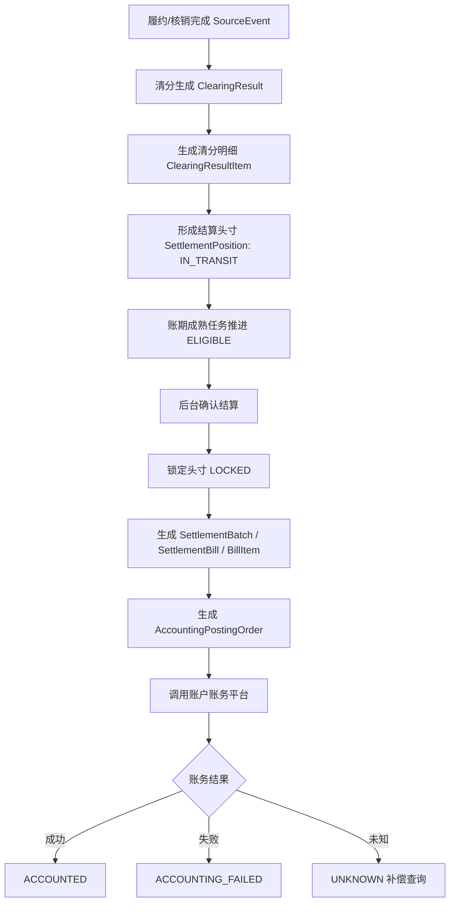

# 清结算平台 V010 方案总览

## 1. 本章结论

V010 是 **P0 正确性闭环版**。它不扩大 P0 范围，不做大数据量性能设计，只补齐会导致资金系统无法安全落地的闭环问题：账期成熟任务、批量结算边界、UNKNOWN 补偿 SLA、操作日志事务策略、request_hash 标准化、导出非 P0 边界。

清结算平台底层主模型保持不变：

```text
SourceEvent
  -> ClearingResult
  -> ClearingResultItem
  -> SettlementPosition
  -> SettlementBatch
  -> SettlementBill
  -> SettlementBillItem
  -> AccountingPostingOrder
  -> AccountingPlatform
```

## 2. 架构目标

| 目标 | 说明 |
|---|---|
| 资金准确 | 明细金额、头寸金额、结算单金额、账务入账金额可校验。 |
| 状态闭环 | 来源事件、清分、结算头寸、结算单、账务入账单均有可编码状态机。 |
| 幂等防重 | 每个写入链路均有业务唯一键、幂等键和 request_hash 冲突判断。 |
| 故障可恢复 | 账务失败、账务 UNKNOWN、重复事件、重复结算均有明确处理路径。 |
| P0 简洁 | 不做容量规划和非主链路能力，避免过度设计。 |

## 3. P0 资金主链路



## 4. P0 不做事项

| 不做项 | 说明 |
|---|---|
| 冻结/止付 | 风控边缘规则，P0 不进入状态机和 DDL。 |
| 退款/冲正 | 未来作为逆向清分和调账能力单独设计。 |
| 出款/提现 | 清结算平台只到商户账户入账，提现由出款平台负责。 |
| 容量规划 | P0 不做分库分表、任务分片、冷热归档和压测指标。 |
| 百万级导出 | 导出不属于清结算核心 P0。 |
| BFF 展示适配 | 底层平台不由前端展示口径反向定义。 |

## 5. 本版开发准入判断

V010 可以作为 P0 开发准入包使用。开发仍应按任务卡逐步推进，不允许一次性全量实现所有上下文。
