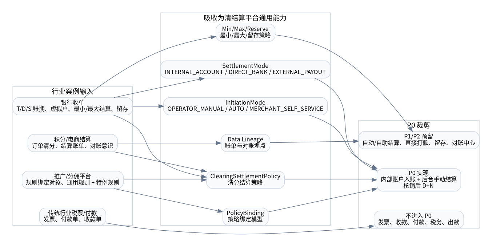

# 清结算平台 V009 方案总览

## 1. 本章结论

V009 是清结算平台的正式 SDD 开发方案，在 V008 的架构表达和开发准入基础上，吸收结算案例文章中适合电商/本地生活平台的成熟能力，重点增强 **清分结算策略上下文**。

本版本不是把传统行业的结算、付款、发票、收款全部并入清结算平台，而是进行行业案例裁剪：只吸收适合我们行业定位的通用结算能力，保持清结算平台主链路简洁、可演进、可开发。

## 2. 核心主线

```text
履约/核销完成事件
  -> SourceEvent 标准业务事实
  -> ClearingResult 清分结果
  -> ClearingResultItem 多参与方清分明细
  -> SettlementPosition 结算头寸
  -> SettlementBill 结算单
  -> AccountingPostingOrder 账务入账单
  -> 账户账务平台入账
```

## 3. V009 新增设计点

| 设计点 | 结论 | P0 落地 |
|---|---|---|
| 结算模式 | `INTERNAL_ACCOUNT / DIRECT_BANK / EXTERNAL_PAYOUT` | P0 只实现 `INTERNAL_ACCOUNT` |
| 发起方式 | `OPERATOR_MANUAL / AUTO / MERCHANT_SELF_SERVICE` | P0 只实现后台运营手动 |
| 账期类型 | `S0 / D0 / D1 / T1 / T_PLUS_N / PERIODIC / MANUAL` | P0 实现核销/履约后 T+N |
| 最小结算金额 | 低于阈值累计或不生成自动结算单 | P0 默认 0，不限制 |
| 最大结算金额 | 超过阈值进入复核/告警 | P0 默认 0，不限制 |
| 留存金额 | 结算时保留一部分金额，后续单独处理 | P0 默认不启用 |
| 策略绑定 | 业务对象引用通用策略，避免每个对象复制配置 | P0 支持按 GLOBAL/BUSINESS_SCENE/MERCHANT 绑定 |

## 4. 核心图谱

### 4.1 行业案例吸收与裁剪



### 4.2 清分结算策略增强模型


### 4.3 结算模式决策视图


### 4.4 系统上下文


### 4.5 正向主链路


### 4.6 数据血缘


## 5. P0 开发范围

P0 只实现普通商品正向清结算闭环：

```text
履约/核销完成
  -> 清分
  -> 形成结算头寸
  -> 账期成熟
  -> 后台运营确认结算
  -> 生成结算单
  -> 调用账户账务平台入账
  -> 清结算平台回写 ACCOUNTED
```

P0 不实现：冻结/止付、退款/冲正、自动出款、直接打款到银行卡、商户自助结算、发票/税务、完整对账中心、BFF 页面展示适配。

## 6. 开发入口

- DDD：`05_DDD领域设计/`
- 策略：`06_策略与清分设计/`
- 流程状态机：`07_核心流程与状态机/`
- DDL：`08_数据模型与存储设计/03_DDL_V009_P0.sql`
- 接口：`09_接口契约与事件协议/openapi.yaml`
- 测试：`13_测试验收/`
- 任务卡：`14_代码落地任务包/03_Codex开发任务卡.md`
