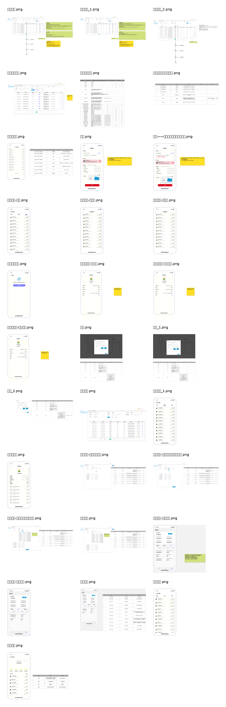

# 当前需求提取全量清单

## 1. 需求来源

本清单从当前原型/需求资料中提取与清结算相关的显性需求。原型中涉及普通业务、邀新业务、团餐业务、渠道业务、结算配置、平台分账规则、后台商家应付、结算确认、结算记录、商户端财务首页、账户首页、待结算明细、结算详情、账户明细、提现等内容。

## 2. 需求域总览

| 需求域 | 需求内容 | 来源页面 | 平台处理 |
|---|---|---|---|
| 资金主线 | 支付冻结、履约/核销、平台发起结算、入账到商户账户、商户提现 | 需求、普通业务流程 | 作为清结算平台正向主链路 |
| 清分规则 | 平台/商户比例、类目比例、会员折扣、优惠券、金豆、推广、邀新、代金券成本分摊 | 平台分账规则、结算配置 | 进入规则上下文和清分上下文 |
| 商家应付 | 待结算订单列表、筛选、单条结算、批量结算、导出 | 商家应付 | 进入清算/待结算/后台运营能力 |
| 结算确认 | 商户名称、结算金额、结算范围、凭证上传、确认结算 | 结算弹窗 | 进入结算单上下文 |
| 结算记录 | 结算单号、业务类型、结算主体、结算金额、凭证、操作人、时间、详情 | 结算记录、详情 | 进入结算查询投影 |
| 商户财务 | 账户余额、待结算、已结算、账户明细、提现中、已提现、结算详情 | 财务首页、账户首页、待结算明细、结算详情 | 结算平台 + 账户账务 + 出款平台聚合 |
| 提现/发票 | 提现申请、提现审核、提现状态、发票上传与查看 | 提现、商户提现申请、审批、查看发票 | 作为出款/发票边界，不放入清结算核心 |
| 多业务扩展 | 团餐、邀新、渠道权益券、推广分佣 | 详情-团餐、系统结构图、平台分账规则 | 平台模型预留，分期实现 |

## 3. 一期必须纳入的需求

| 编号 | 需求 | 说明 |
|---|---|---|
| REQ-CS-001 | 本地生活普通商品订单可进入清结算链路 | 核销/履约完成后生成标准结算事件。 |
| REQ-CS-002 | 按当前结算配置进行清分 | 支持平台/商户比例、优惠券、会员折扣、金豆等金额项建模。 |
| REQ-CS-003 | 生成清分结果和规则快照 | 规则变更不影响历史订单。 |
| REQ-CS-004 | 进入待结算池 | 按核销时间 + 结算周期计算可结算时间。 |
| REQ-CS-005 | 后台商家应付列表 | 支持订单号、商户、商品、核销时间、状态等筛选。 |
| REQ-CS-006 | 单条结算和批量结算 | 批量必须校验同一商户、同一结算场景、未结算状态。 |
| REQ-CS-007 | 结算确认弹窗 | 展示商户、金额、范围，上传凭证后确认。 |
| REQ-CS-008 | 生成结算批次、结算单、结算明细 | 结算单为后续入账和商户展示依据。 |
| REQ-CS-009 | 结算单状态机 | 支持待确认、入账中、成功、失败、未知、取消。 |
| REQ-CS-010 | 调用账户账务平台入账 | 结算成功后形成可提现余额和资金流水。 |
| REQ-CS-011 | 商户端待结算、已结算、结算记录、结算详情 | 从清结算平台查询投影获取；余额和流水以账户账务为准。 |
| REQ-CS-012 | 操作审计与凭证追溯 | 记录操作人、时间、凭证、失败原因、重试次数。 |
| REQ-CS-013 | 最小对账 | 一期至少校验结算单和账户账务流水一致性。 |

## 4. 后续纳入的需求

| 编号 | 需求 | 阶段 |
|---|---|---|
| REQ-CS-P1-001 | 团餐业务清结算 | P1 |
| REQ-CS-P1-002 | 邀新/推广分佣清结算 | P1/P2 |
| REQ-CS-P1-003 | 渠道权益券应收/应付清结算 | P1 |
| REQ-CS-P2-001 | 按摩平台接入，支持技师、门店、平台、渠道多方分润 | P2 |
| REQ-CS-P2-002 | 结算后退款冲正、调账、补结 | P2 |
| REQ-CS-P2-003 | 完整对账差错处理工作台 | P2 |
| REQ-CS-P3-001 | 自动结算、规则引擎、风控冻结、财务报表 | P3 |
