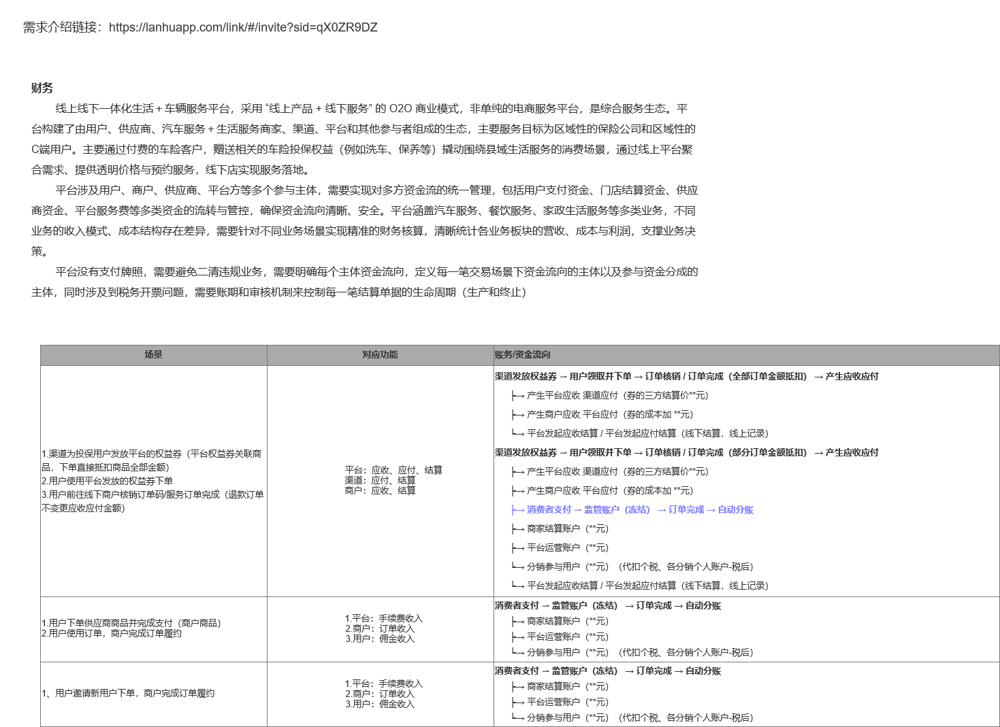
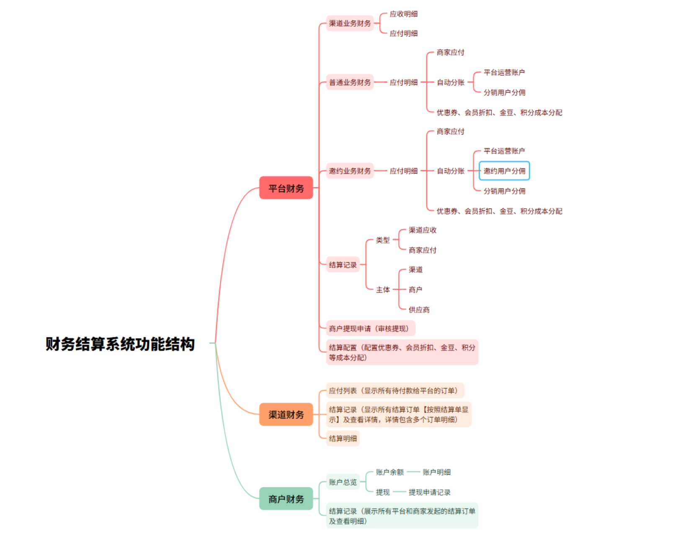
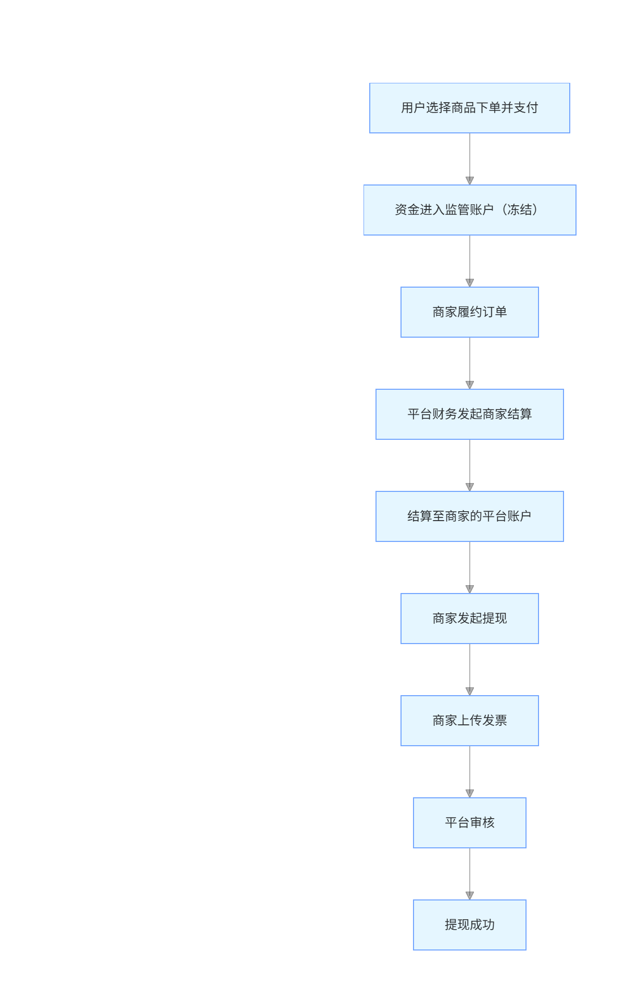
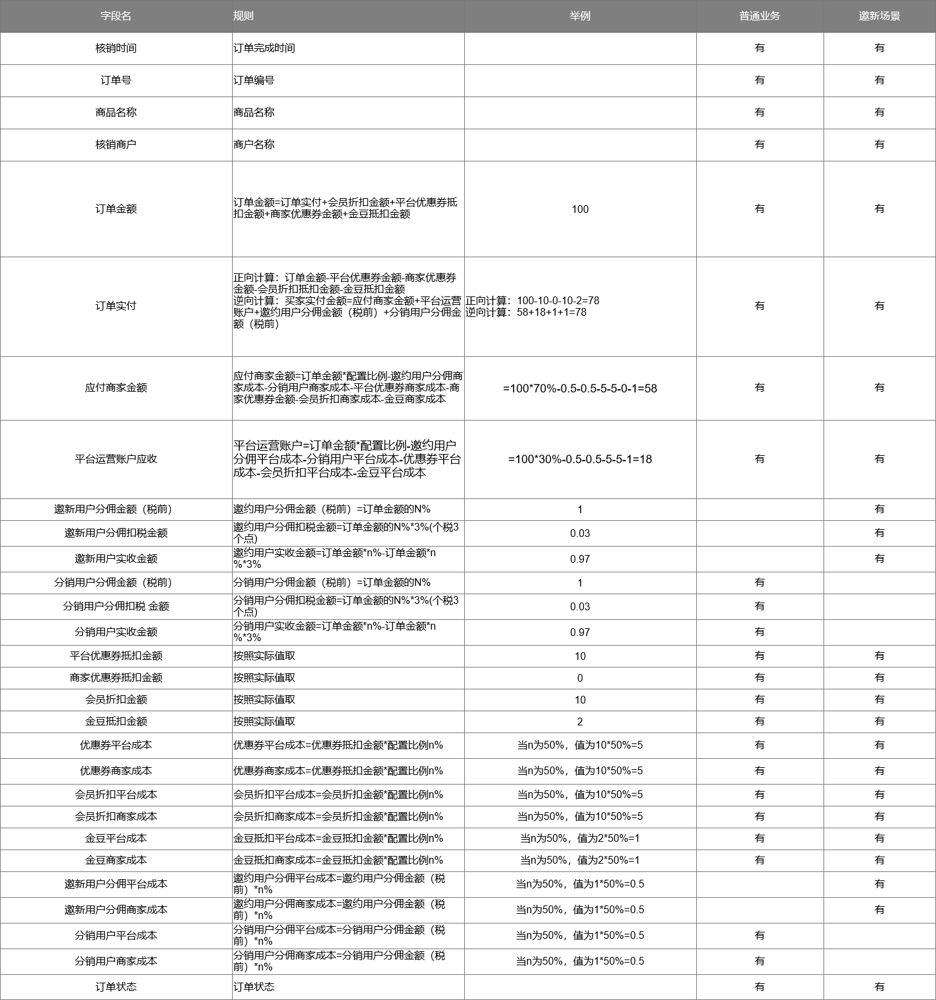
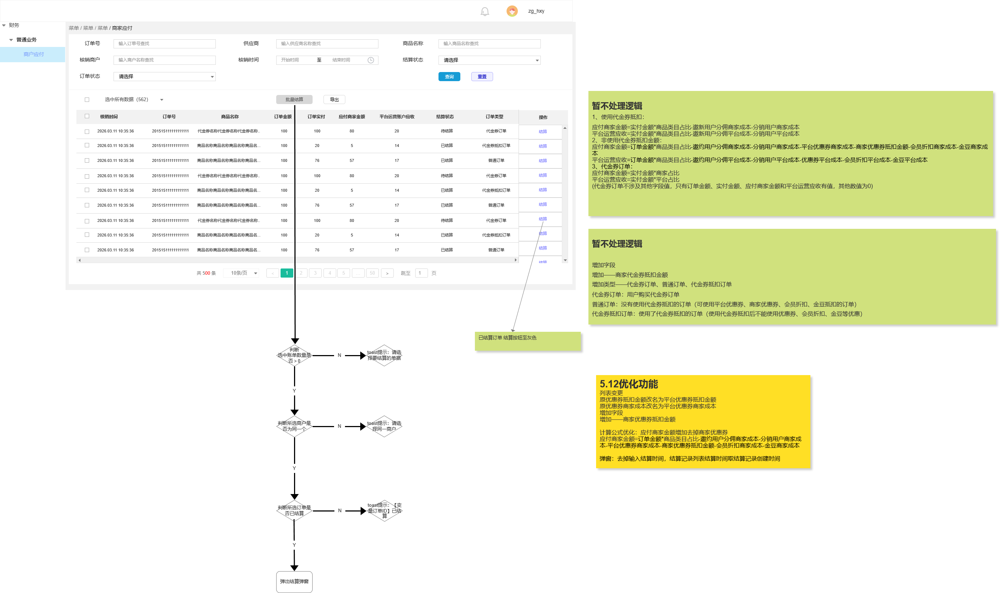
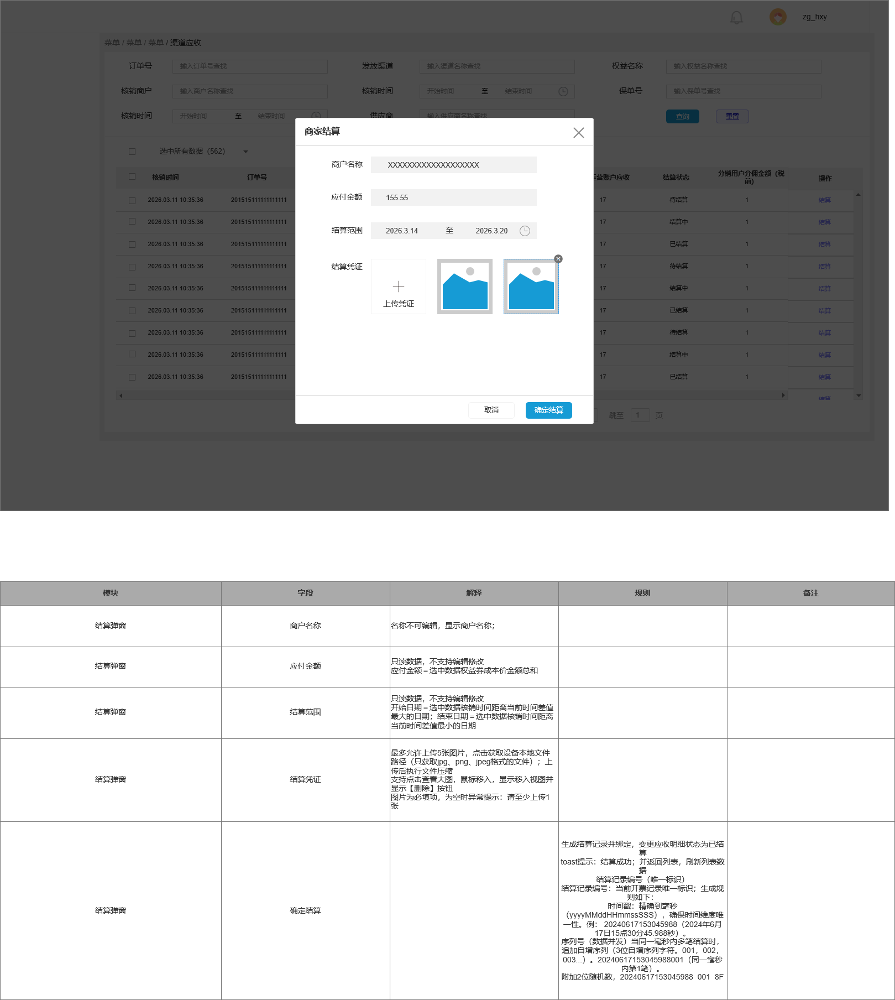
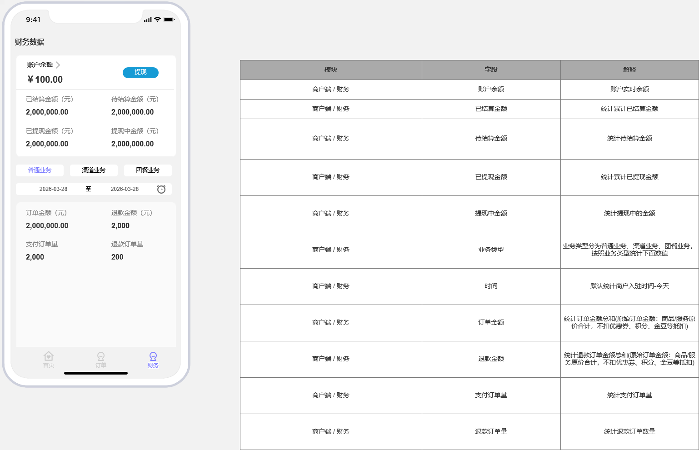
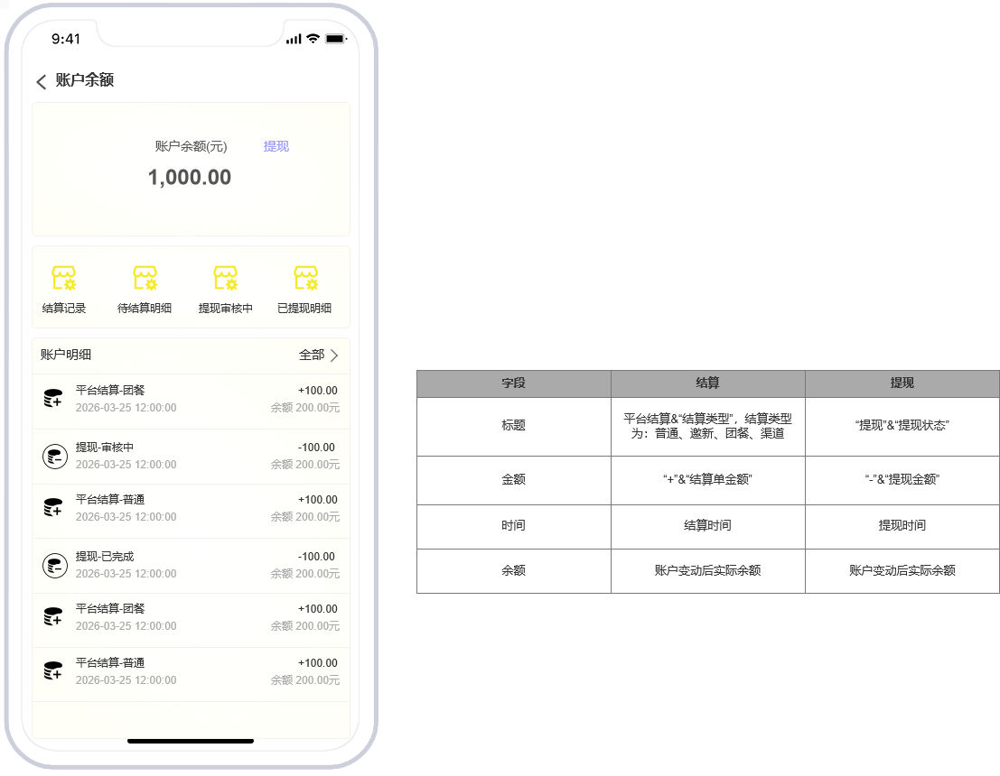
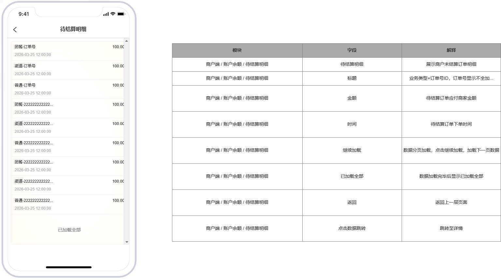

# 页面证据与需求映射

## 1. 平台需求背景

## 2. 系统结构与业务流程

## 3. 清分规则证据

## 4. 后台商家应付与结算确认

## 5. 商户端资金展示

## 6. 页面到需求映射表

| 原型页面 | 主要需求 | 领域归属 |
|---|---|---|
| 需求 | 资金主线、二清规避、多主体资金管理 | 平台定位、合规边界 |
| 普通业务流程 | 支付冻结、履约完成、平台结算、商户入账、提现 | 主链路 |
| 系统结构图 | 普通/邀新/团餐/渠道/提现/财务模块 | 业务接入、后续扩展 |
| 平台分账规则 | 平台/商户比例、优惠成本、会员折扣、金豆、推广、邀新 | 规则与清分 |
| 商家应付 | 待结算列表、筛选、批量结算、状态 | 清算与待结算 |
| 结算 | 结算金额、范围、凭证、确认 | 结算单 |
| 结算记录 | 结算单查询、详情、凭证、操作人 | 查询投影 |
| 财务首页/账户首页 | 余额、已结算、待结算、提现入口 | 商户资金查询 |
| 待结算明细/结算详情 | 明细与详情 | 查询投影 |
| 提现/发票 | 提现审核、发票材料 | 出款/发票边界 |
