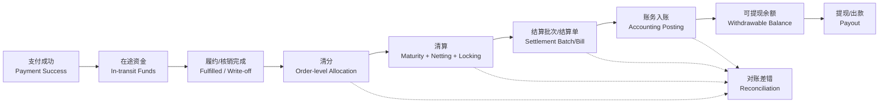
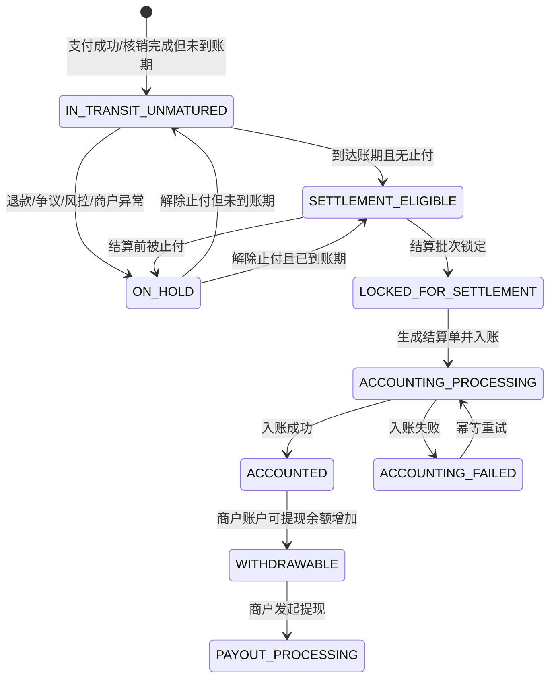

# 行业清结算参考模型

## 1. 本方案只参考电商/本地生活平台

本方案不泛化到证券、银行间清算或跨境金融市场。对“清算/结算”的基础定义参考支付清算行业通用术语，但平台能力模型只落到电商与本地生活交易场景。

## 2. 成熟平台的通用资金主线



## 3. 冻结/止付能力在成熟平台中是否存在

成熟的电商/本地生活交易资金平台通常会有冻结、止付或保留能力，但它不应该替代“在途”概念。

| 能力 | 行业含义 | 本平台口径 |
|---|---|---|
| 在途资金 | 支付成功后、结算入账前的交易资金状态 | 一期主线必须有。 |
| 冻结户/担保户 | 第三方平台或支付通道用于担保交易的账户表达 | 本平台不直接管理真实资金户，只记录状态和结算资格。 |
| 止付/Hold | 因退款、争议、风控、商户异常等限制结算或提现 | 平台底层必须建模，P0 可不实现复杂规则。 |
| 可提现账户 | 结算或分账后资金进入可提现余额 | 由账户账务平台提供余额事实。 |

## 4. 标准资金状态



## 5. 对当前产品口径的处理

当前产品把“核销完、未结算”称为待结算，这是可以接受的展示口径。但底层平台必须保留行业标准状态。

```text
商户端待结算展示 = IN_TRANSIT_UNMATURED + SETTLEMENT_ELIGIBLE + LOCKED_FOR_SETTLEMENT/ACCOUNTING_PROCESSING（可配置）
后台商家应付 = SETTLEMENT_ELIGIBLE
后台结算中 = LOCKED_FOR_SETTLEMENT + ACCOUNTING_PROCESSING
商户端已结算 = ACCOUNTED
可提现余额 = Accounting Platform available balance
```

## 6. 行业依据

- 支付清算行业中，clearing 通常包含结算前的传输、核对、确认、轧差/净额计算，settlement 才是最终解除资金义务或完成资金交割。
- 本地生活/电商平台公开方案中，支付后进入在途/冻结/担保资金，满足履约或分账周期后再结算到可提现账户，是常见模式。
- 大规模平台对账一般按漏结、重复结、错结治理，并优先采用双向、明细级对账。
