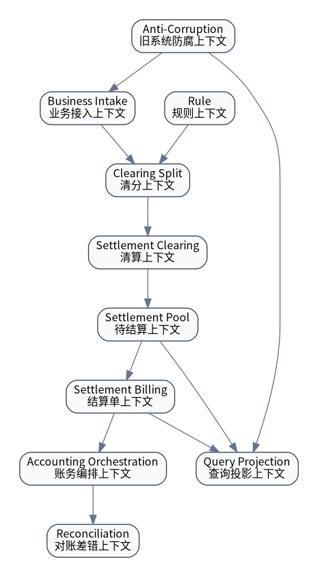

# 限界上下文

| 上下文 | 职责 | 核心对象 | 不负责 |
|---|---|---|---|
| Business Intake 业务接入 | 接收不同业务线事件，转换为标准结算事件和订单快照。 | SourceEvent、SourceOrderSnapshot | 不计算金额归属。 |
| Rule 规则 | 管理账期、比例、成本分摊、规则版本与快照。 | Rule、RuleSnapshot | 不重算历史清分结果。 |
| Clearing Split 清分 | 单笔订单/核销维度金额拆分。 | ClearingResult、ClearingResultItem | 不生成最终结算单。 |
| Settlement Clearing 清算 | 周期汇总、账期成熟、冻结/解冻、轧差、可结算确认。 | ClearingBatch、PendingSettlementItem | 不直接入账。 |
| Settlement Billing 结算单 | 生成结算批次、结算单、结算明细、凭证和状态机。 | SettlementBatch、SettlementBill、SettlementBillItem | 不保存余额最终事实。 |
| Accounting Orchestration 账务编排 | 调账户账务平台入账，处理幂等、失败、未知和重试。 | AccountingOrder | 不自行记账。 |
| Query Projection 查询投影 | 面向后台和商户端提供列表、统计、详情。 | AdminPayableView、MerchantSettlementView | 不承载写逻辑。 |
| Reconciliation 对账差错 | 多层对账、差异识别和处理闭环。 | ReconcileTask、ReconcileDiff | 不负责业务履约。 |
| Anti-Corruption 防腐 | 隔离旧表、旧接口和业务系统差异。 | LegacyGateway、LocalLifeAdapter | 不继续扩展旧模型。 |
