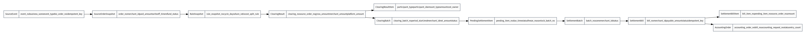

# 聚合根和值对象

## 1. 聚合根

| 聚合根 | 聚合内对象 | 关键不变量 |
|---|---|---|
| SourceEvent | SourceOrderSnapshot、FulfillmentSnapshot、RefundSnapshot | 同一业务事件只处理一次。 |
| SettlementRule | RuleVersion、RuleSnapshot、CostSplitRule | 规则发布后形成快照，历史快照不可变。 |
| ClearingResult | ClearingResultItem | 清分项合计必须和主金额一致；金额项必须有参与方。 |
| ClearingBatch | ClearingBatchItem、NettingSummary | 同一清算批次的维度一致，汇总金额可反查明细。 |
| PendingSettlementItem | FreezeRecord、LockRecord | 有效待结算项只能被一个有效结算批次锁定。 |
| SettlementBatch | SettlementBill | 批次状态约束其下结算单状态。 |
| SettlementBill | SettlementBillItem、SettlementVoucher、OperationLog | 结算金额等于明细合计；成功入账后不可取消。 |
| AccountingOrder | AccountingAttempt | 同一结算单只允许一个有效入账单；重试复用幂等键。 |
| ReconcileTask | ReconcileDiff | 差异必须能定位源单据、金额项和处理状态。 |

## 2. 值对象

| 值对象 | 字段 | 说明 |
|---|---|---|
| Money | amount、currency | 金额统一封装，避免浮点误差。 |
| BusinessScene | LOCAL_LIFE、MASSAGE、CHANNEL、GROUP、INVITE | 业务场景。 |
| SettlementScene | PRODUCT、SERVICE、GROUP_MEAL、COUPON、COMMISSION | 结算场景。 |
| Participant | participant_type、participant_id、subject_id | 资金参与方。 |
| Period | start_time、end_time | 账期或结算范围。 |
| IdempotentKey | key、scope | 幂等键。 |
| RuleSnapshotNo | value | 规则快照编号。 |
| BillNo | value | 结算单号。 |

## 3. 金额项枚举

| amount_type | 说明 |
|---|---|
| ORDER_AMOUNT | 订单金额 |
| PAID_AMOUNT | 实付金额 |
| MERCHANT_PAYABLE | 商户应付/应结金额 |
| PLATFORM_RECEIVABLE | 平台应收/平台佣金 |
| PLATFORM_COUPON_COST | 平台优惠券成本 |
| MERCHANT_COUPON_COST | 商户优惠券成本 |
| MEMBER_DISCOUNT_PLATFORM_COST | 会员折扣平台成本 |
| MEMBER_DISCOUNT_MERCHANT_COST | 会员折扣商户成本 |
| JINDOU_PLATFORM_COST | 金豆平台成本 |
| JINDOU_MERCHANT_COST | 金豆商户成本 |
| PROMOTION_COMMISSION | 推广分佣 |
| INVITE_COMMISSION | 邀新分佣 |
| TECHNICIAN_COMMISSION | 技师佣金，按摩平台预留 |
| STORE_SHARE | 门店分成，按摩平台预留 |
| REFUND_REVERSAL | 退款冲减 |
