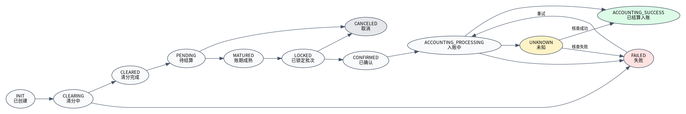

# 状态机设计

## 1. 状态说明

| 状态 | 对象 | 含义 | 是否商户可见已结算 |
|---|---|---|---:|
| INIT | SourceEvent | 标准事件已接入 | 否 |
| CLEARING | ClearingResult | 清分处理中 | 否 |
| CLEARED | ClearingResult | 清分完成 | 否 |
| PENDING | PendingItem | 待结算，账期未成熟或未锁定 | 否 |
| MATURED | PendingItem | 账期成熟，可结算 | 否 |
| LOCKED | PendingItem | 已被结算批次锁定 | 否 |
| CONFIRMED | SettlementBill | 结算单已确认 | 否 |
| ACCOUNTING_PROCESSING | AccountingOrder | 入账处理中 | 否 |
| ACCOUNTING_SUCCESS | SettlementBill | 已完成入账 | 是 |
| FAILED | 任意写链路对象 | 清分/结算/入账失败 | 否 |
| UNKNOWN | AccountingOrder | 账务结果未知 | 否 |
| CANCELED | PendingItem/Bill | 取消 | 否 |

## 2. 核心规则

- 只有 `ACCOUNTING_SUCCESS` 结算单计入商户端已结算金额。
- `PENDING`、`MATURED`、`LOCKED` 均不能展示为已结算。
- 入账失败不得把待结算项永久标记为成功。
- `UNKNOWN` 必须通过幂等查询或人工核查修复。
- 结算重试必须复用原 `idempotent_key`。
- 成功结算单不可取消，只能通过冲正/调账处理。
