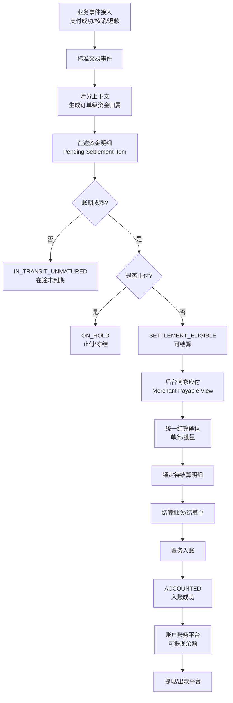

# SDD 修订总览

## 1. 本次修订目标

V002 的目标是把清结算平台从“当前产品页面驱动”修订为“行业标准领域模型驱动”。

修订后的设计满足：

1. 术语符合电商/本地生活清结算平台成熟口径。
2. 平台底层支持大规模多业务线，不被当前页面文案绑定。
3. 当前需求通过 Adapter + Query BFF 纳入一期，而不是污染核心领域。
4. 一期可开发范围清晰，后续扩展不需要推翻底层模型。

## 2. 关键修订点

| 编号 | V001 问题 | V002 修订 |
|---|---|---|
| REV-001 | 资金主线出现“支付冻结”，容易被误解为当前需求已有冻结 | 改为“支付成功形成在途资金/担保资金事实”；冻结/止付作为风险限制能力独立建模。 |
| REV-002 | 待结算口径容易被当前产品绑定 | 底层拆为 `IN_TRANSIT_UNMATURED`、`SETTLEMENT_ELIGIBLE`、`LOCKED_FOR_SETTLEMENT` 等，BFF 聚合展示。 |
| REV-003 | 清算解释不够行业化 | 明确定义为清分后、结算前的账期成熟、聚合轧差、锁定、金额校验、结算候选生成。 |
| REV-004 | 当前需求对平台设计影响过大 | 建立“行业核心模型 + 当前业务适配层”的设计硬约束。 |
| REV-005 | 冻结是否需要设计不明确 | 作为成熟清结算平台标准能力预留：P0 建状态和字段，P1/P2 实现风控/争议/退款止付规则。 |
| REV-006 | 单条/批量结算可能被拆两套逻辑 | 统一为 `confirmMerchantSettlement(command)`，单条是批量大小为 1 的特殊情况。 |
| REV-007 | 当前产品“商家应付”与平台清算层关系不清 | 定义后台商家应付 = `SETTLEMENT_ELIGIBLE` 的运营视图。 |

## 3. 修订后的主链路

## 4. 一期实现裁剪

| 能力 | 平台是否设计 | 一期是否实现 | 说明 |
|---|---:|---:|---|
| 在途资金状态 | 是 | 是 | 支付/核销后未入账均属于在途生命周期。 |
| 清分结果 | 是 | 是 | 可以先映射现有 finance_detail，后续独立计算。 |
| 清算成熟判断 | 是 | 是 | 结算周期 + 核销时间。 |
| 止付/冻结 | 是 | 字段/状态预留 | 不做复杂风控规则。 |
| 商家应付 | 是 | 是 | 只展示可结算项。 |
| 单条/批量结算 | 是 | 是 | 一个核心方法。 |
| 结算单状态机 | 是 | 是 | 必须实现。 |
| 账务入账 | 是 | 是 | 复用账户账务平台。 |
| 商户端待结算展示 | 是 | 是 | BFF 聚合在途/可结算。 |
| 对账差错 | 是 | P1 | 一期保留表和接口边界可选。 |
| 自动出款 | 是 | 否 | 结算只入账，可提现后由提现平台处理。 |
