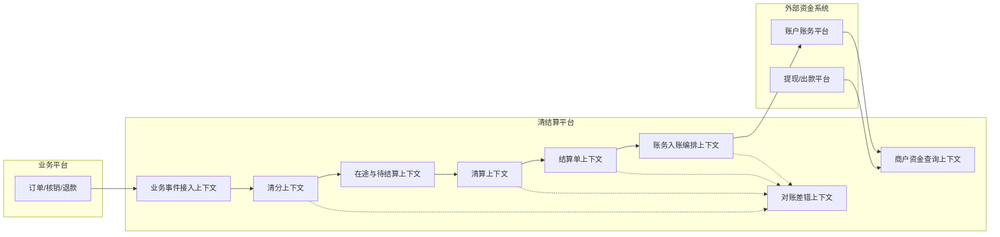

# 限界上下文与领域语言

## 1. 限界上下文总览



## 2. 上下文职责

| 上下文 | 核心职责 | 关键对象 |
|---|---|---|
| 业务事件接入 | 接收业务事件，转为标准交易事件，保证幂等。 | `TradeEvent`、`SourceEvent` |
| 清分 | 单笔订单资金归属计算，保存规则快照。 | `ClearingResult`、`ClearingResultItem`、`RuleSnapshot` |
| 在途与待结算 | 管理清分后未入账的资金生命周期。 | `PendingSettlementItem`、`InTransitStatus`、`HoldRecord` |
| 清算 | 账期成熟、止付判断、聚合轧差、锁定、生成结算候选。 | `SettlementPosition`、`ClearingBatch` |
| 结算单 | 生成结算批次、结算单、结算明细和状态机。 | `SettlementBatch`、`SettlementBill`、`SettlementBillItem` |
| 账务入账编排 | 调用账户账务平台，处理幂等、失败、未知、重试。 | `AccountingPostingOrder` |
| 商户资金查询 | 提供 BFF 展示口径，翻译产品用词。 | `MerchantFinanceProjection` |
| 对账差错 | 发现漏结、重结、错结，记录并处理差异。 | `ReconcileTask`、`ReconcileDiff` |

## 3. 聚合边界

### PendingSettlementItem 聚合

不变量：

1. 同一个清分明细只能对应一个有效待结算项。
2. `ACCOUNTED` 后不可再次被锁定。
3. `ON_HOLD` 状态不可进入结算批次。
4. 锁定必须带 `settlement_batch_no` 和幂等键。
5. 解除止付后必须重新判断账期成熟。

### SettlementBill 聚合

不变量：

1. 结算单金额等于明细金额之和。
2. 同一结算单只允许一次成功入账。
3. 重试必须复用同一个 `accounting_idempotent_key`。
4. 只有 `ACCOUNTED` 才可对外展示为底层已结算。
5. 结算单取消只允许在未入账前执行。

## 4. 领域事件

| 事件 | 触发时机 | 消费方 |
|---|---|---|
| `TradeEventAccepted` | 标准业务事件入库成功 | 清分上下文 |
| `ClearingResultGenerated` | 清分结果生成 | 在途与待结算上下文 |
| `PendingItemMatured` | 账期成熟 | 清算上下文/后台查询投影 |
| `PendingItemHeld` | 被止付 | 商户查询投影、运营后台 |
| `SettlementPositionLocked` | 清算锁定可结算项 | 结算单上下文 |
| `SettlementBillCreated` | 结算单生成 | 账务入账编排 |
| `SettlementAccounted` | 账务入账成功 | 商户查询投影、对账上下文 |
| `SettlementAccountingFailed` | 入账失败 | 运营后台、重试任务 |
```
