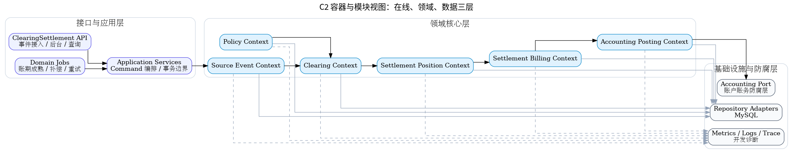

# C4 L2 容器与模块

## 本章结论

平台内部按接口应用层、领域核心层、基础设施防腐层组织，避免单 Service 承载所有职责。

## 设计目标

1. 用图明确架构边界和协作关系。
2. 让研发能够从图直接映射到包、类、表和接口。
3. 让测试能够从图识别关键路径和失败路径。

## 开发落点

本章对应 `05_DDD领域设计/`、`07_核心流程与状态机/`、`08_数据模型与存储设计/` 和 `09_接口契约与事件协议/`。

## 验证方式

开发评审时必须检查图中每个模块是否在工程结构、接口契约、数据表和任务卡中有对应实现。
