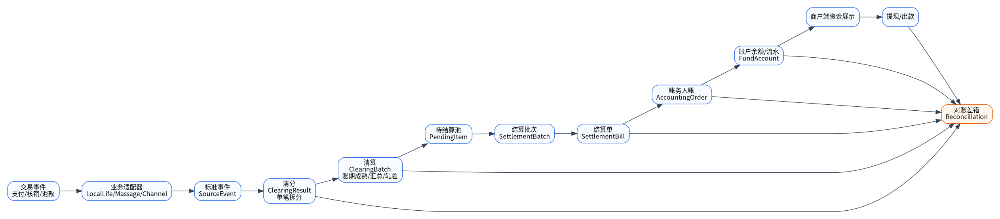

# 清分清算结算主链路

## 1. 正向链路

| 步骤 | 输入 | 处理 | 输出 |
|---|---|---|---|
| 1. 事件接入 | 支付成功、核销完成、退款事件 | Adapter 标准化、幂等校验 | SourceEvent |
| 2. 清分 | 订单快照、规则快照 | 拆分商户应付、平台应收、优惠成本、佣金 | ClearingResult、ClearingResultItem |
| 3. 清算 | 清分结果、账期规则、冻结规则 | 账期成熟判断、汇总、轧差、可结算确认 | ClearingBatch、PendingSettlementItem |
| 4. 结算 | 待结算项、操作人、凭证 | 创建批次、结算单、明细，状态流转 | SettlementBatch、SettlementBill |
| 5. 账务入账 | 结算单 | 调用账户账务平台，生成流水和余额变化 | AccountingOrder、fund_account_flow |
| 6. 商户展示 | 结算单、待结算项、账户流水 | 构建查询投影 | 待结算、已结算、结算详情、账户明细 |
| 7. 提现衔接 | 可提现余额 | 商户申请提现 | 出款平台处理 |

## 2. 逆向链路

| 场景 | 一期处理 | 后续处理 |
|---|---|---|
| 结算前退款 | 待结算项剔除或生成负向清分项 | 自动逆向清算 |
| 结算后退款 | 一期先进入待处理/人工核查 | P2 做冲正、调账、退分账 |
| 账务失败 | 结算单失败，可重试 | 失败工作台 |
| 账务未知 | UNKNOWN，按幂等键查询修复 | 自动巡检任务 |
| 重复结算 | 唯一索引和状态机拦截 | 对账补充识别 |
