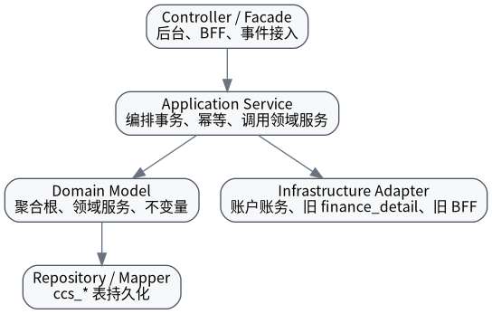

# 技术架构总览

## 分层职责

| 层 | 职责 |
|---|---|
| Controller / Facade | 入参校验、鉴权、调用 Application Service。 |
| Application Service | 事务编排、幂等检查、聚合协作、调用外部适配器。 |
| Domain Model | 状态机、不变量、金额校验。 |
| Repository / Mapper | 持久化，不承载业务规则。 |
| Infrastructure Adapter | 账户账务、旧表查询、BFF 查询适配。 |
