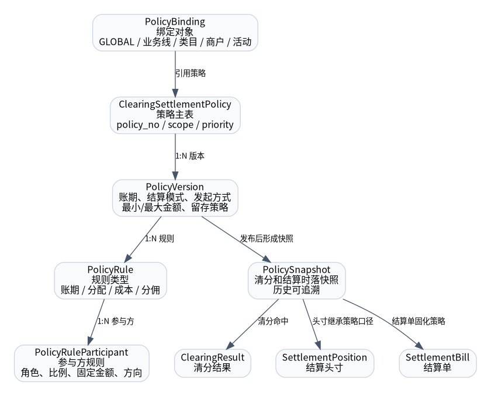

# 清分结算策略定位

## 1. 本章结论

产品页面中的“结算配置”在底层不能建模为普通配置表，应建模为 **清分结算策略 ClearingSettlementPolicy**。

策略上下文负责决定：一笔履约事实如何清分、何时可结算、由谁承担优惠成本、以什么结算模式入账、由谁发起结算，以及是否受最小/最大结算金额和留存策略影响。

## 2. 设计目标

| 目标 | 说明 |
|---|---|
| 平台化 | 支持本地生活普通商品、团餐、按摩、渠道、推广等多业务线。 |
| 可运营 | 运营可按业务线、类目、商户、活动绑定不同策略。 |
| 可追溯 | 每次清分和结算必须固化策略版本和规则快照。 |
| 可扩展 | 支持账期、分配、成本承担、分佣、最小金额、留存等策略扩展。 |
| 不污染主链路 | P0 只启用必要策略，其他字段不驱动额外流程。 |

## 3. 领域对象

| 对象 | 职责 |
|---|---|
| `ClearingSettlementPolicy` | 策略主对象，表达策略名称、作用域、优先级、状态。 |
| `PolicyVersion` | 策略版本，表达账期、结算模式、发起方式、阈值和留存规则。 |
| `PolicyRule` | 规则项，表达账期、收入分配、优惠成本承担、分佣等规则。 |
| `PolicyRuleParticipant` | 参与方规则，表达角色、比例、固定金额、金额方向。 |
| `PolicyBinding` | 策略绑定对象，表达哪些业务对象引用哪个策略。 |
| `PolicySnapshot` | 清分和结算时固化的策略快照，用于历史追溯。 |

## 4. P0 策略裁剪

| 策略能力 | P0 默认值 | 是否执行 |
|---|---|---:|
| 结算模式 | `INTERNAL_ACCOUNT` | 是 |
| 发起方式 | `OPERATOR_MANUAL` | 是 |
| 账期类型 | `T_PLUS_N` | 是 |
| 成本承担 | 平台/商户比例清分 | 是 |
| 分佣 | 可建模，P0 可不启用 | 否/按需 |
| 最小结算金额 | 0 | 不限制 |
| 最大结算金额 | 0 | 不限制 |
| 留存金额 | NONE / 0 | 不留存 |
| 自动结算 | 关闭 | 否 |
| 商户自助结算 | 关闭 | 否 |

## 5. 开发落点

- DDD：`SettlementPolicyContext`
- 聚合：`ClearingSettlementPolicy`
- 表：`ccs_settlement_policy`、`ccs_settlement_policy_version`、`ccs_policy_rule`、`ccs_policy_rule_participant`、`ccs_settlement_policy_binding`
- 服务：`PolicyMatchDomainService`、`PolicySnapshotService`
- 规则快照使用方：`ClearingService`、`SettlementPositionService`、`SettlementBillingService`
