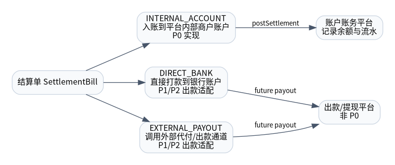

# 结算模式与发起方式

## 1. 本章结论

行业案例中常见“结算到银行卡”和“结算到虚拟户”两类模式。对于本平台，P0 只实现 **结算入账到账户账务平台内部商户账户**，后续商户通过提现/出款平台提款。

## 2. 结算模式

| 结算模式 | 领域枚举 | 定义 | P0 |
|---|---|---|---:|
| 内部账户入账 | `INTERNAL_ACCOUNT` | 结算成功后调用账户账务平台增加商户账户余额。 | 是 |
| 直接打款到银行账户 | `DIRECT_BANK` | 结算单直接驱动银行账户打款。 | 否 |
| 外部出款/代付 | `EXTERNAL_PAYOUT` | 结算单驱动出款/提现平台生成出款单。 | 否 |

P0 只实现 `INTERNAL_ACCOUNT`。其他模式仅为后续业务扩展预留，不得在 P0 代码中引入出款流程。

## 3. 发起方式

| 发起方式 | 领域枚举 | 定义 | P0 |
|---|---|---|---:|
| 后台运营手动 | `OPERATOR_MANUAL` | 运营在后台选择可结算头寸并确认结算。 | 是 |
| 系统自动结算 | `AUTO` | 系统根据策略和调度任务自动生成结算单。 | 否 |
| 商户自助结算 | `MERCHANT_SELF_SERVICE` | 商户端发起结算申请。 | 否 |

P0 只允许后台运营通过统一方法 `confirmMerchantSettlement` 发起结算。

## 4. 设计约束

- 结算模式和发起方式都属于策略版本字段，不属于页面展示字段。
- `SettlementBill` 需要固化生成时使用的模式和发起方式，保证历史可追溯。
- P0 不允许在 `INTERNAL_ACCOUNT` 之外分支调用出款平台。
- 未来新增自动结算或商户自助结算时，不改变结算单和头寸状态机，只增加发起入口。
