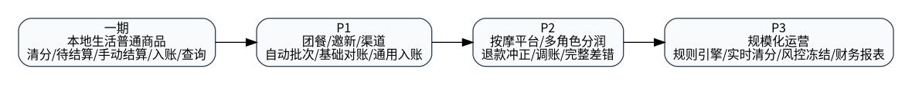

# 一期目标与范围



## 1. 一期目标

一期实现本地生活普通商品清结算最小闭环：

```text
本地生活普通商品核销完成
  -> 标准事件
  -> 清分结果和规则快照
  -> 清算/待结算池
  -> 后台商家应付
  -> 运营确认结算并上传凭证
  -> 结算批次/结算单/明细
  -> 账户账务入账
  -> 商户端展示已结算/待结算/结算详情
```

## 2. 一期必须实现

- 新建清结算领域模块；
- 本地生活普通商品 Adapter；
- 清分结果与金额项；
- 规则快照；
- 待结算池；
- 后台商家应付列表；
- 单条/批量结算预校验；
- 结算凭证；
- 结算批次、结算单、结算明细；
- 结算状态机；
- 账务入账编排；
- 商户端待结算和已结算查询；
- 操作日志；
- 最小对账。

## 3. 一期不实现

- 自动出款；
- 完整发票系统；
- 团餐、邀新、渠道全量接入；
- 按摩平台接入；
- 复杂规则引擎；
- 完整差错工作台；
- 历史数据全量迁移。
