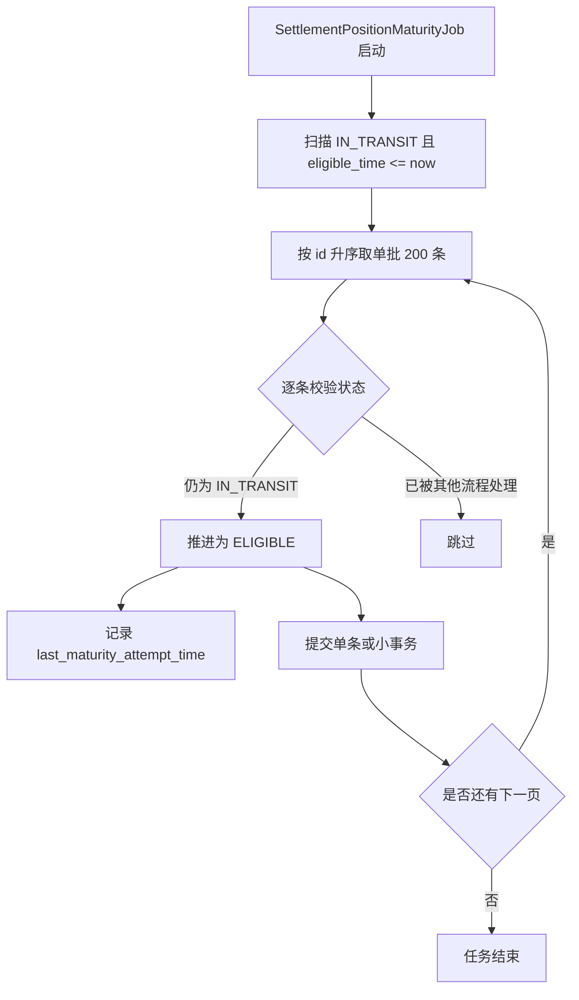

# 清算与头寸成熟流程

## 1. 本章结论

清算阶段的核心职责是将已清分的结算头寸从 **在途状态** 推进到 **可结算状态**。P0 必须有最小账期成熟任务，否则 `SettlementPosition` 会停留在 `IN_TRANSIT`，后台无法稳定查询可结算头寸。

本章只定义状态闭环所需的最小任务规格，不做分片调度、容量规划和复杂任务平台。

## 2. 设计目标

| 目标 | 说明 |
|---|---|
| 状态可推进 | `eligible_time <= now` 的 `IN_TRANSIT` 头寸可自动变为 `ELIGIBLE`。 |
| 幂等 | 任务重复执行不会重复生成头寸或错误推进终态。 |
| 小批量 | 单轮有限条数，避免一次任务持锁过久。 |
| 失败可见 | 失败头寸记录错误原因，下轮仍可重试。 |
| 非容量方案 | P0 不解决大商户海量头寸和分片问题。 |

## 3. 流程图

## 4. 最小任务规格

| 项 | P0 规格 |
|---|---|
| 任务名 | `SettlementPositionMaturityJob` |
| 触发方式 | 定时触发，默认每 5 分钟一次，配置化 |
| 扫描条件 | `lifecycle_status = IN_TRANSIT and eligible_time <= now() and deleted = 0` |
| 排序 | `id asc` |
| 单轮数量 | 默认 200 条，配置化 |
| 更新方式 | 推荐单条或小事务推进，避免大事务 |
| 幂等规则 | 只允许 `IN_TRANSIT -> ELIGIBLE`，其他状态跳过 |
| 失败处理 | 保持 `IN_TRANSIT`，记录 `last_error_code / last_error_message` |
| 下轮重试 | 失败头寸下轮继续扫描 |
| 不做事项 | 分片、分布式锁优化、复杂调度平台、容量规划 |

## 5. 状态转移

| 当前状态 | 触发事件 | 前置条件 | 目标状态 | 失败处理 |
|---|---|---|---|---|
| IN_TRANSIT | maturePosition | `eligible_time <= now` | ELIGIBLE | 保持 IN_TRANSIT，记录错误 |
| ELIGIBLE | maturePosition 重入 | 已经成熟 | ELIGIBLE | 幂等跳过 |
| LOCKED | maturePosition 重入 | 已被结算锁定 | LOCKED | 幂等跳过 |
| ACCOUNTED | maturePosition 重入 | 已入账成功 | ACCOUNTED | 幂等跳过 |
| CANCELED | maturePosition 重入 | 已取消 | CANCELED | 幂等跳过 |

## 6. 开发落点

| 类 | 职责 |
|---|---|
| `SettlementPositionMaturityJob` | 定时触发成熟任务。 |
| `SettlementPositionApplicationService.matureEligiblePositions()` | 应用层编排扫描和推进。 |
| `SettlementPositionRepository.findMatureCandidates()` | 查询满足成熟条件的头寸。 |
| `SettlementPosition.markEligible()` | 聚合方法，执行状态变更和不变量校验。 |

## 7. 验证方式

| 用例 | 预期 |
|---|---|
| `IN_TRANSIT` 且 `eligible_time` 到期 | 状态变为 `ELIGIBLE`。 |
| `IN_TRANSIT` 但未到期 | 不变更。 |
| 已为 `ELIGIBLE` | 重复任务不产生副作用。 |
| 单条推进失败 | 失败不影响其他头寸。 |
| 单轮超过 200 条 | 本轮只处理 200 条，下轮继续。 |
