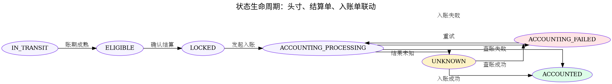

# 清算与头寸成熟流程

## 本章结论

清算层负责把清分金额项转为结算头寸，并按账期策略推进状态。后台商家应付只查询 `ELIGIBLE` 头寸。

## 状态转移

| 当前状态 | 事件 | 条件 | 目标状态 |
|---|---|---|---|
| IN_TRANSIT | mature | 当前时间 >= eligible_time | ELIGIBLE |
| ELIGIBLE | lockForSettlement | 被结算单锁定 | LOCKED |
| LOCKED | startAccounting | 结算单发起入账 | ACCOUNTING_PROCESSING |
| ACCOUNTING_PROCESSING | accountingSuccess | 账务成功 | ACCOUNTED |
| ACCOUNTING_PROCESSING | accountingFailed | 账务失败 | ACCOUNTING_FAILED |
| ACCOUNTING_PROCESSING | accountingUnknown | 账务结果未知 | UNKNOWN |
| ACCOUNTING_FAILED | retryAccounting | 人工/任务重试 | ACCOUNTING_PROCESSING |
| UNKNOWN | queryAccountingSuccess | 查询账务成功 | ACCOUNTED |
| UNKNOWN | queryAccountingFailed | 查询账务失败 | ACCOUNTING_FAILED |
