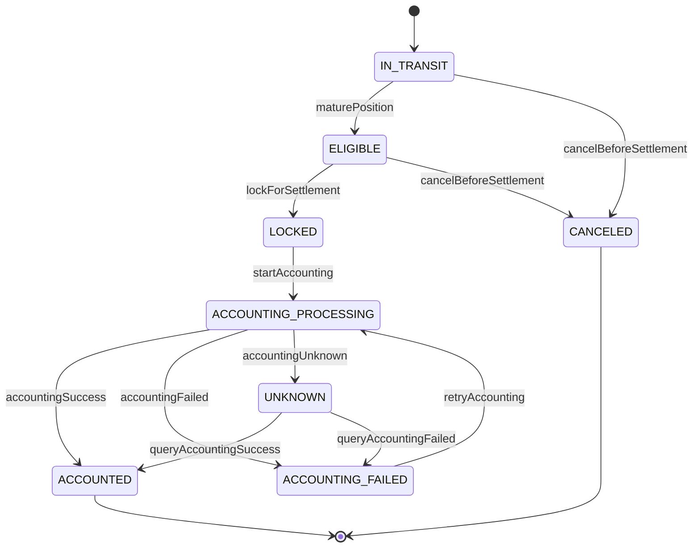

# SettlementPosition 状态机

## 1. 本章结论

`SettlementPosition` 是清算阶段的核心聚合，表达某个清分明细在结算前后的资金头寸生命周期。P0 状态机必须闭合从 `IN_TRANSIT` 到 `ACCOUNTED` 的正向路径，并处理账务失败和 UNKNOWN。

## 2. 状态定义

| 状态 | 含义 | 是否可结算 | 是否终态 |
|---|---|---:|---:|
| `IN_TRANSIT` | 在途头寸，尚未到可结算时间 | 否 | 否 |
| `ELIGIBLE` | 已到可结算时间，可被后台结算确认选择 | 是 | 否 |
| `LOCKED` | 已被某个结算批次/结算单锁定 | 否 | 否 |
| `ACCOUNTING_PROCESSING` | 关联结算单正在入账 | 否 | 否 |
| `ACCOUNTING_FAILED` | 账务入账失败，可随结算单重试 | 否 | 否 |
| `UNKNOWN` | 账务结果未知，需先查账务平台 | 否 | 否 |
| `ACCOUNTED` | 已入账成功 | 否 | 是 |
| `CANCELED` | 已取消，不参与结算 | 否 | 是 |

## 3. 状态图

## 4. 状态转移矩阵

| 当前状态 | 事件 | 前置条件 | 领域动作 | 目标状态 | 幂等 | 可重试 | 测试用例 |
|---|---|---|---|---|---|---|---|
| IN_TRANSIT | `maturePosition` | `eligible_time <= now` | 设置成熟时间、状态推进 | ELIGIBLE | 是 | 是 | TC-POS-001 |
| ELIGIBLE | `lockForSettlement` | 未被锁定，结算主体一致 | 写入 `locked_batch_no / locked_bill_no` | LOCKED | 是 | 否 | TC-POS-002 |
| LOCKED | `startAccounting` | 结算单已确认 | 状态推进 | ACCOUNTING_PROCESSING | 是 | 否 | TC-POS-003 |
| ACCOUNTING_PROCESSING | `accountingSuccess` | 账务返回成功 | 写入入账时间 | ACCOUNTED | 是 | 否 | TC-POS-004 |
| ACCOUNTING_PROCESSING | `accountingFailed` | 账务明确失败 | 写入失败码 | ACCOUNTING_FAILED | 是 | 是 | TC-POS-005 |
| ACCOUNTING_PROCESSING | `accountingUnknown` | 账务结果不可判定 | 标记 UNKNOWN | UNKNOWN | 是 | 先查账务 | TC-POS-006 |
| ACCOUNTING_FAILED | `retryAccounting` | 结算单允许重试 | 随结算单进入入账中 | ACCOUNTING_PROCESSING | 是 | 是 | TC-POS-007 |
| UNKNOWN | `queryAccountingSuccess` | 账务查询成功 | 回正成功态 | ACCOUNTED | 是 | 否 | TC-POS-008 |
| UNKNOWN | `queryAccountingFailed` | 账务查询失败 | 回正失败态 | ACCOUNTING_FAILED | 是 | 是 | TC-POS-009 |
| IN_TRANSIT / ELIGIBLE | `cancelBeforeSettlement` | 未锁定 | 取消头寸 | CANCELED | 是 | 否 | TC-POS-010 |

## 5. 禁止转移

| 禁止转移 | 原因 |
|---|---|
| `ACCOUNTED -> 任意非终态` | 已入账成功不可回退。 |
| `CANCELED -> 任意非终态` | 已取消不可恢复。 |
| `LOCKED -> ELIGIBLE` | 已锁定不可直接释放，P0 不做解锁重分配。 |
| `ACCOUNTING_PROCESSING -> CANCELED` | 入账中禁止取消。 |
| `UNKNOWN -> ACCOUNTING_PROCESSING` | 未查明账务结果前禁止重复入账。 |

## 6. P0 边界

P0 不做冻结/止付，不做退款反向头寸，不做部分解锁，不做跨批次重分配。
