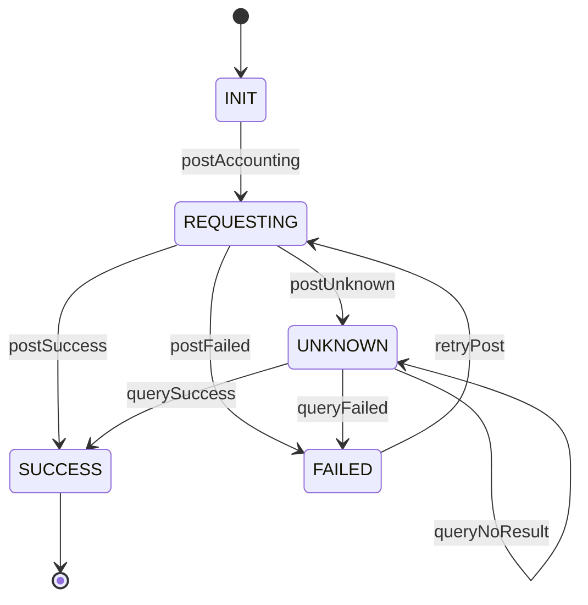

# AccountingPostingOrder 状态机

## 1. 本章结论

`AccountingPostingOrder` 是清结算平台对账户账务平台发起入账的本地编排单。它的状态机必须重点处理 `UNKNOWN`，因为账务调用超时可能导致本地不知道账务是否已成功。

## 2. 状态定义

| 状态 | 含义 | 是否终态 |
|---|---|---:|
| `INIT` | 已创建，尚未调用账务平台 | 否 |
| `REQUESTING` | 正在调用账户账务平台 | 否 |
| `SUCCESS` | 账务平台确认入账成功 | 是 |
| `FAILED` | 账务平台明确返回失败 | 否 |
| `UNKNOWN` | 调用超时或结果不可判定 | 否 |

## 3. 状态图

## 4. UNKNOWN 补偿 SLA

| 项 | P0 规则 |
|---|---|
| 进入 UNKNOWN 条件 | 账务调用超时、网络异常、返回结果不可判定、未拿到账务确定结果。 |
| 自动核查间隔 | 默认每 2 分钟一次，配置化。 |
| 最大自动核查次数 | 5 次。 |
| 逾期阈值 | UNKNOWN 持续 10 分钟仍未回正，计入 overdue 指标。 |
| 人工介入条件 | UNKNOWN 超过 30 分钟，或连续 5 次查询无确定结果。 |
| 查询依据 | 优先 `accounting_request_no`；没有时使用 `accounting_idempotent_key + caller_system + biz_domain + biz_no + accounting_scene`。 |
| 禁止行为 | UNKNOWN 状态禁止直接再次发起入账，必须先查询账务平台。 |

## 5. 状态转移矩阵

| 当前状态 | 事件 | 前置条件 | 领域动作 | 目标状态 | 幂等 | 测试用例 |
|---|---|---|---|---|---|---|
| INIT | `postAccounting` | 结算单已确认 | 调用账务平台 | REQUESTING | 是 | TC-POST-001 |
| REQUESTING | `postSuccess` | 账务明确成功 | 回写 `accounting_request_no / fund_account_flow_no` | SUCCESS | 是 | TC-POST-002 |
| REQUESTING | `postFailed` | 账务明确失败 | 写失败码和失败原因 | FAILED | 是 | TC-POST-003 |
| REQUESTING | `postUnknown` | 结果不可判定 | 设置 `unknown_first_time / next_query_time` | UNKNOWN | 是 | TC-POST-004 |
| FAILED | `retryPost` | 重试次数未超限 | 复用账务幂等键重试 | REQUESTING | 是 | TC-POST-005 |
| UNKNOWN | `querySuccess` | 查询账务成功 | 回写账务信息 | SUCCESS | 是 | TC-POST-006 |
| UNKNOWN | `queryFailed` | 查询账务明确失败 | 写失败状态 | FAILED | 是 | TC-POST-007 |
| UNKNOWN | `queryNoResult` | 查询无结果且未超限 | 增加查询次数，更新下次查询时间 | UNKNOWN | 是 | TC-POST-008 |
| UNKNOWN | `manualRequired` | 超过 SLA | 标记人工介入 | UNKNOWN | 是 | TC-POST-009 |

## 6. 开发落点

| 类 | 职责 |
|---|---|
| `AccountingPostingApplicationService` | 编排入账、查询补偿和状态联动。 |
| `SettlementAccountingPort` | 屏蔽账户账务平台具体接口。 |
| `AccountingPostingOrder` | 聚合状态机和不变量。 |
| `AccountingUnknownCompensationJob` | 周期性核查 UNKNOWN 入账单。 |
