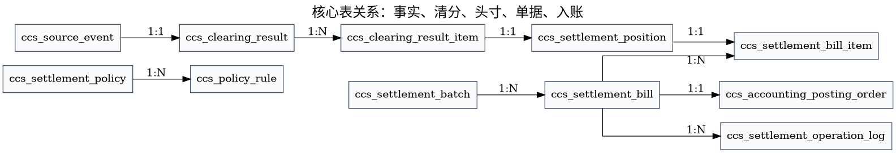

# 逻辑数据模型



## 本章结论

数据模型按事实、清分、头寸、单据、入账五类组织。任何表都必须对应一个领域对象或支撑对象，不能为了页面展示单独污染核心领域模型。

| 类别 | 表 | 说明 |
|---|---|---|
| 策略 | `ccs_settlement_policy` 等 | 策略、规则、参与方、快照。 |
| 事实 | `ccs_source_event` | 标准业务事实。 |
| 清分 | `ccs_clearing_result`、`ccs_clearing_result_item` | 多参与方金额归属。 |
| 清算 | `ccs_settlement_position` | 在途、可结算、锁定、入账状态。 |
| 结算 | `ccs_settlement_batch`、`ccs_settlement_bill`、`ccs_settlement_bill_item` | 结算单据。 |
| 入账 | `ccs_accounting_posting_order` | 账务入账编排。 |
| 审计 | `ccs_settlement_operation_log` | 操作和诊断记录。 |

## V009 策略增强补充

V009 在逻辑模型中新增 `PolicyBinding`，并增强 `PolicyVersion` 与 `SettlementBill` 的策略字段。逻辑关系如下：

```text
PolicyBinding -> ClearingSettlementPolicy -> PolicyVersion -> PolicyRule -> PolicyRuleParticipant
                           |                  |             |
                           v                  v             v
                     PolicySnapshot       ClearingResult  SettlementPosition / SettlementBill
```

设计结论：业务对象只绑定策略，不复制策略；清分和结算时固化策略版本和规则快照，后续策略变更不影响历史头寸和结算单。
