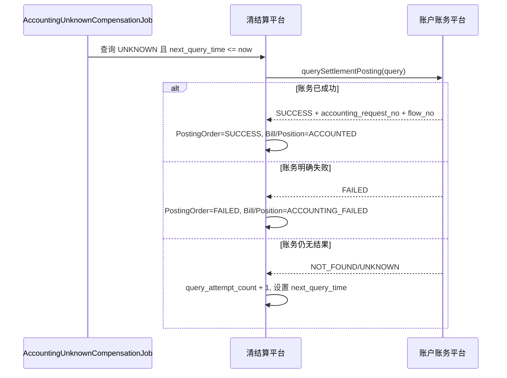

# 账务 UNKNOWN 补偿

## 1. 本章结论

`UNKNOWN` 是账务入账链路中最需要谨慎处理的状态。进入 UNKNOWN 后，清结算平台无法判断账务平台是否已入账成功，因此禁止直接重复入账，必须先通过账务查询端口核查结果。

## 2. 进入 UNKNOWN 的条件

| 场景 | 说明 |
|---|---|
| 调用超时 | HTTP/RPC 超时，但无法确认账务平台是否处理。 |
| 网络异常 | 连接中断、网关异常、响应丢失。 |
| 结果不可判定 | 返回码不是明确成功或明确失败。 |
| 本地异常 | 发起请求后本地进程异常，未能记录结果。 |

## 3. SLA 规则

| 项 | P0 规则 |
|---|---|
| 自动查询频率 | 每 2 分钟一次，配置化。 |
| 最大自动查询次数 | 5 次。 |
| 逾期阈值 | UNKNOWN 持续 10 分钟仍未回正，计入 overdue 指标。 |
| 人工介入阈值 | UNKNOWN 超过 30 分钟，或连续 5 次查询无确定结果。 |
| 查询优先级 | `accounting_request_no` > `accounting_idempotent_key` > `caller_system + biz_domain + biz_no + accounting_scene`。 |
| 禁止行为 | UNKNOWN 状态禁止直接重新发起入账。 |

## 4. 补偿流程



## 5. 查询条件对象

```java
class AccountingPostingQuery {
    String accountingRequestNo;      // 可选
    String accountingIdempotentKey;  // 必填
    String callerSystem;             // 必填
    String bizDomain;                // 必填
    String bizNo;                    // 必填
    String accountingScene;          // 必填
}
```

## 6. 人工介入

进入人工介入条件后：

1. `AccountingPostingOrder.manual_intervention_required = 1`。
2. 后台诊断页展示 `posting_no / bill_no / accounting_idempotent_key / query_attempt_count / last_error_message`。
3. 人工处理前仍不得直接重新入账。
4. 人工可先查询账务平台，再根据账务结果执行回正。

## 7. 指标

| 指标 | 说明 |
|---|---|
| `ccs_accounting_unknown_total` | 当前 UNKNOWN 数量。 |
| `ccs_accounting_unknown_overdue_total` | 超过 10 分钟未回正数量。 |
| `ccs_accounting_unknown_manual_required_total` | 需要人工介入数量。 |
| `ccs_accounting_unknown_recovered_total` | 自动查询回正数量。 |

## 8. 测试用例

| 用例 | 预期 |
|---|---|
| 账务调用超时 | PostingOrder 进入 UNKNOWN。 |
| UNKNOWN 查询成功 | PostingOrder/SBill/Position 回正 ACCOUNTED。 |
| UNKNOWN 查询失败 | 回正 ACCOUNTING_FAILED。 |
| UNKNOWN 查询无结果 5 次 | 标记人工介入。 |
| UNKNOWN 直接重入账 | 拒绝。 |
