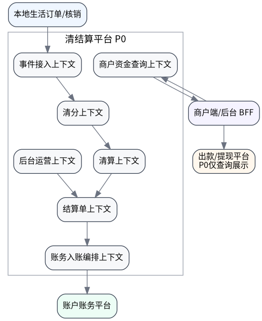

# 清结算平台 V004 SDD 开发准入版 - 完整评审稿


---

<!-- source: 00_总览入口/00_当前规范.md -->

# 当前规范

## 1. 文档定位

本目录为清结算平台 V004 当前有效技术方案入口。V004 是在 V003 一期普通商品落地准入版基础上，按正式技术方案目录、数据库建表规范、DDD/SDD 落地规范、状态机矩阵规范和 Codex 任务卡规范进行的规范对齐版本。

## 2. 本版不改变的设计方向

- 清结算平台仍按成熟本地生活/电商平台清结算中心设计。
- P0 仍只支持普通商品核销完成后的清结算入账闭环。
- 当前产品口径只作为 BFF 展示适配输入，不反向定义底层领域语言。
- 冻结/止付、自动出款、TRANSFER、完整对账差错均不进入 P0。

## 3. 本版新增的开发准入约束

- DDL 必须是可执行 MySQL 8.x SQL。
- 金额字段统一使用 `BIGINT`，单位分，人民币。
- 当前阶段不设计 `currency / cur / currency_code` 字段。
- 当前阶段不设计 `tenant_id` 字段。
- 主键统一 `BIGINT UNSIGNED`。
- 所有写入链路必须包含幂等键和请求指纹。
- 状态机必须使用矩阵表达，并覆盖失败、未知、重试、取消和终态保护。


---

<!-- source: 00_总览入口/03_本版修订说明.md -->

# V004 修订说明

## 1. 继承 V003 的内容

- 清分、清算、结算、账务入账编排四段式主链路。
- P0 只落普通商品核销完成后的清结算入账。
- 单条和批量结算共用 `confirmMerchantSettlement`。
- 三套状态机：待结算项、结算单、账务入账单。
- 产品“待结算”宽口径由 BFF 适配，底层仍区分在途和可结算。

## 2. V004 主要修改

| 修改项 | 说明 |
|---|---|
| 目录规范 | 调整为正式平台技术方案目录。 |
| DDL | 改成可执行 MySQL 8.x DDL，金额 `BIGINT` 分，删除 `currency` 和 `tenant_id`。 |
| 跨平台字段 | 增加 `caller_system / biz_domain / biz_no`，避免 source 旧口径扩散。 |
| 请求指纹 | 增加 `request_hash`，用于幂等冲突判断。 |
| 状态矩阵 | 状态机改成开发/测试可用矩阵。 |
| DDD | 补限界上下文、聚合不变量、领域事件。 |
| SDD | 补 DTO、接口、任务卡、准出清单、灰度回滚。 |

## 3. 明确不引入

- P0 不引入冻结/止付状态和字段。
- P0 不引入出款核心 TRANSFER 主链路。
- P0 不做自动出款。
- P0 不做完整对账差错工作台。


---

<!-- source: 01_业务场景与需求/00_一期普通商品范围与非范围.md -->

# 一期普通商品范围与非范围

## 1. P0 目标

建设普通商品核销完成后的清结算入账闭环：

```text
核销完成 -> 清分 -> 清算 -> 商家应付 -> 确认结算 -> 账务入账 -> 商户端展示
```

## 2. P0 范围

| 能力 | P0 是否做 | 说明 |
|---|---:|---|
| 核销完成事件接入 | 是 | 接收 `WRITE_OFF_COMPLETED`。 |
| 普通商品清分结果 | 是 | P0 可从现有 `local_order_finance_detail` 映射。 |
| 待结算项 | 是 | 管理在途、可结算、锁定、入账中、入账成功/失败。 |
| 后台商家应付 | 是 | 仅展示 `ELIGIBLE` 数据。 |
| 单条/批量结算 | 是 | 共用一个核心方法。 |
| 结算批次/结算单/结算明细 | 是 | 标准单据闭环。 |
| 账务入账编排 | 是 | 调用 `recordProductSettlement`。 |
| 商户端查询 | 是 | BFF 聚合新老数据。 |
| 退款最小规则 | 是 | 结算前/中/后三类规则。 |

## 3. P0 非范围

| 能力 | 处理 |
|---|---|
| 团餐、邀新、渠道权益券 | P1/P2 接入，不进入 P0。 |
| 自动结算 | P1。 |
| 自动出款 | 非 P0。结算只到商户账户可提现余额。 |
| 出款核心 TRANSFER | 非 P0，仅保留未来适配说明。 |
| 完整对账差错工作台 | P1。P0 只留状态、单号和诊断字段。 |
| 冻结/止付 | 非 P0，不建字段、不建状态、不建接口。 |
| 历史全量迁移 | 非 P0，新老双轨，旧链路收尾。 |


---

<!-- source: 01_业务场景与需求/02_当前产品口径与底层领域口径适配.md -->

# 当前产品口径与底层领域口径适配

当前产品页面里的“待结算”是宽口径：只要核销完成且未完成结算，页面可能都称为待结算。底层清结算平台不能按这个宽口径设计，否则会把未到账期数据错误暴露给后台结算动作。

## 1. 底层标准口径

| 底层状态 | 说明 | 是否后台可结算 | 是否商户端可归入待结算展示 |
|---|---|---:|---:|
| `IN_TRANSIT` | 核销已完成但未到账期 | 否 | 是 |
| `ELIGIBLE` | 已到账期，可被后台结算 | 是 | 是 |
| `LOCKED` | 已锁定进结算单 | 否 | 可按产品口径展示为处理中 |
| `ACCOUNTING_PROCESSING` | 入账处理中 | 否 | 可按产品口径展示为处理中 |
| `ACCOUNTING_FAILED` | 入账失败 | 否 | 后台可见；商户端默认不展示失败态 |
| `ACCOUNTED` | 已入账成功 | 否 | 不属于待结算，属于已结算 |
| `CANCELED` | 已取消 | 否 | 不展示 |

## 2. BFF 适配规则

商户端待结算展示建议聚合：

```text
IN_TRANSIT + ELIGIBLE + LOCKED + ACCOUNTING_PROCESSING
```

后台商家应付必须只查询：

```text
ELIGIBLE
```

## 3. 设计原则

产品展示口径可以宽，底层领域状态必须精确。所有“能不能点结算”的判断只允许由清算上下文基于 `ELIGIBLE` 判断。


---

<!-- source: 02_领域模型/00_领域模型总览.md -->

# 领域模型总览



## 1. 限界上下文

| 上下文 | 核心职责 | 主要聚合 |
|---|---|---|
| 事件接入上下文 | 接收和幂等处理来源事件 | `SourceEvent` |
| 清分上下文 | 生成订单级资金归属 | `ClearingResult`、`ClearingResultItem` |
| 清算上下文 | 管理待结算项生命周期 | `PendingSettlementItem` |
| 结算单上下文 | 生成结算批次、结算单、明细 | `SettlementBatch`、`SettlementBill` |
| 账务入账编排上下文 | 调账务平台并处理状态 | `AccountingPostingOrder` |
| 商户资金查询上下文 | 面向 BFF 提供读模型 | Query Projection |
| 后台运营上下文 | 商家应付、重试、人工核查 | Application Service |

## 2. 聚合边界原则

1. 聚合内维护自身不变量，不跨聚合直接改状态。
2. 跨聚合状态推进由 Application Service 编排。
3. 账务入账是外部副作用，必须通过 `AccountingPostingOrder` 显式记录。
4. 幂等、状态校验和金额校验属于写入主流程，不允许只在 Controller 做校验。


---

<!-- source: 02_领域模型/04_领域服务与不变量.md -->

# 领域服务与不变量

## 1. 领域服务

| 服务 | 职责 |
|---|---|
| `ClearingDomainService` | 普通商品清分映射、金额校验、生成清分结果。 |
| `SettlementPreparationDomainService` | 账期成熟判断、待结算项生成和生命周期推进。 |
| `SettlementBillDomainService` | 统一确认结算、金额汇总、批次/结算单/明细生成。 |
| `AccountingPostingDomainService` | 入账单状态推进、失败/UNKNOWN 处理。 |
| `RefundSettlementDomainService` | 结算前/中/后退款最小规则。 |

## 2. 聚合不变量

### PendingSettlementItem

1. 同一个 `clearing_item_no` 只能生成一个 `pending_no`。
2. `ACCOUNTED` 是成功终态，不允许回到 `ELIGIBLE`、`LOCKED` 或 `ACCOUNTING_PROCESSING`。
3. `LOCKED` 必须有关联 `locked_bill_no` 和 `locked_batch_no`。
4. `ACCOUNTING_PROCESSING` 必须有关联 `locked_bill_no`。
5. `CANCELED` 不允许被结算。
6. `settlement_amount_cent` 不能小于 0。

### SettlementBill

1. 一个 `bill_no` 只能对应一个 `batch_no`。
2. `CREATED` / `CONFIRMED` 才允许取消。
3. `ACCOUNTING_PROCESSING` 不允许取消。
4. `ACCOUNTED` 是成功终态。
5. `UNKNOWN` 只能通过账务查询补偿回正为 `ACCOUNTED` 或 `ACCOUNTING_FAILED`。
6. 同一幂等键且 `request_hash` 一致返回原单。
7. 同一幂等键但 `request_hash` 不一致必须拒绝。

### AccountingPostingOrder

1. 一个 `bill_no` 只能有一个 `posting_no`。
2. `SUCCESS` 是成功终态。
3. `FAILED` 可以重试。
4. `UNKNOWN` 必须先查询账务平台，不允许直接重复入账。
5. 每次调用账务平台必须复用同一 `accounting_idempotent_key`。


---

<!-- source: 03_流程与状态机/00_主链路总览.md -->

# 主链路总览


## 主流程

1. 本地生活订单核销完成，发送 `WRITE_OFF_COMPLETED`。
2. 清结算平台写入 `ccs_source_event`，通过幂等键防重复。
3. 清分上下文生成 `ccs_clearing_result` 和 `ccs_clearing_result_item`。
4. 清算上下文生成 `ccs_pending_settlement_item`。
5. 若未到账期，状态为 `IN_TRANSIT`；到账期后推进为 `ELIGIBLE`。
6. 后台商家应付只查询 `ELIGIBLE`。
7. 运营确认单条或批量结算，统一进入 `confirmMerchantSettlement`。
8. 系统锁定待结算项，生成批次、结算单、结算明细。
9. 账务入账编排调用账户账务平台 `recordProductSettlement`。
10. 账务成功后，结算单、待结算项和入账单同步推进为成功态。


---

<!-- source: 03_流程与状态机/02_待结算项状态机.md -->

# 待结算项状态机

## 1. 状态定义

| 状态 | 说明 | 是否后台可结算 | 是否终态 |
|---|---|---:|---:|
| `IN_TRANSIT` | 已核销但未到账期 | 否 | 否 |
| `ELIGIBLE` | 已到账期，可结算 | 是 | 否 |
| `LOCKED` | 已锁定进结算单 | 否 | 否 |
| `ACCOUNTING_PROCESSING` | 入账处理中 | 否 | 否 |
| `ACCOUNTING_FAILED` | 入账失败 | 否 | 否 |
| `ACCOUNTED` | 入账成功 | 否 | 是 |
| `CANCELED` | 已取消 | 否 | 是 |

## 2. 状态流转矩阵

| 当前状态 | 触发事件 | 前置条件 | 领域动作 | 目标状态 | 失败目标状态 | 是否幂等 | 是否可重试 | 测试用例 |
|---|---|---|---|---|---|---:|---:|---|
| `IN_TRANSIT` | `mature` | `eligible_time <= now` | 标记可结算 | `ELIGIBLE` | 保持原状态 | 是 | 是 | TC-PENDING-001 |
| `IN_TRANSIT` | `refundFullBeforeSettlement` | 全额退款 | 作废待结算项 | `CANCELED` | 保持原状态 | 是 | 否 | TC-PENDING-002 |
| `IN_TRANSIT` | `refundPartialBeforeSettlement` | 部分退款 | 调整 `settlement_amount_cent` | `IN_TRANSIT` | 保持原状态 | 是 | 是 | TC-PENDING-003 |
| `ELIGIBLE` | `lockForSettlement` | 结算确认且金额校验通过 | 写锁定单号 | `LOCKED` | `ELIGIBLE` | 是 | 是 | TC-PENDING-004 |
| `ELIGIBLE` | `refundFullBeforeSettlement` | 全额退款 | 作废待结算项 | `CANCELED` | `ELIGIBLE` | 是 | 否 | TC-PENDING-005 |
| `LOCKED` | `startAccounting` | 结算单进入入账 | 联动入账中 | `ACCOUNTING_PROCESSING` | `LOCKED` | 是 | 是 | TC-PENDING-006 |
| `LOCKED` | `cancelBillBeforeAccounting` | 结算单未入账 | 释放锁定 | `ELIGIBLE` | `LOCKED` | 是 | 是 | TC-PENDING-007 |
| `ACCOUNTING_PROCESSING` | `accountingSuccess` | 账务成功 | 标记入账成功时间 | `ACCOUNTED` | `ACCOUNTING_PROCESSING` | 是 | 是 | TC-PENDING-008 |
| `ACCOUNTING_PROCESSING` | `accountingFailed` | 账务失败 | 标记失败 | `ACCOUNTING_FAILED` | `ACCOUNTING_PROCESSING` | 是 | 是 | TC-PENDING-009 |
| `ACCOUNTING_FAILED` | `retryAccounting` | 结算单重试 | 联动入账中 | `ACCOUNTING_PROCESSING` | `ACCOUNTING_FAILED` | 是 | 是 | TC-PENDING-010 |

## 3. 禁止流转

- `ACCOUNTED` 不允许回到任何非终态。
- `CANCELED` 不允许回到任何非终态。
- `ACCOUNTING_PROCESSING` 不允许直接取消。
- `LOCKED` 不允许被其他结算单再次锁定。

## 4. 开发要求

- 状态变更必须在领域方法中判断，不允许直接在 Mapper 层更新状态。
- 每次状态变化必须写 `ccs_settlement_operation_log`。
- 所有状态矩阵用例必须进入测试。


---

<!-- source: 03_流程与状态机/03_结算单状态机.md -->

# 结算单状态机

## 1. 状态定义

| 状态 | 说明 | 是否可取消 | 是否可重试 | 是否商户端已结算 |
|---|---|---:|---:|---:|
| `CREATED` | 已创建 | 是 | 否 | 否 |
| `CONFIRMED` | 已确认，待入账 | 是，限入账前 | 是 | 否 |
| `ACCOUNTING_PROCESSING` | 入账处理中 | 否 | 否 | 否 |
| `ACCOUNTED` | 入账成功 | 否 | 否 | 是 |
| `ACCOUNTING_FAILED` | 入账失败 | 否 | 是 | 否 |
| `UNKNOWN` | 账务结果未知 | 否 | 需先查询 | 否 |
| `CANCELED` | 已取消 | 否 | 否 | 否 |

## 2. 状态流转矩阵

| 当前状态 | 触发事件 | 前置条件 | 领域动作 | 目标状态 | 失败目标状态 | 是否幂等 | 是否可重试 | 测试用例 |
|---|---|---|---|---|---|---:|---:|---|
| `CREATED` | `confirm` | 明细已锁定，金额一致 | 标记确认 | `CONFIRMED` | `CREATED` | 是 | 是 | TC-BILL-001 |
| `CREATED` | `cancel` | 未入账 | 释放待结算项 | `CANCELED` | `CREATED` | 是 | 是 | TC-BILL-002 |
| `CONFIRMED` | `startAccounting` | 入账单已创建 | 状态入账中 | `ACCOUNTING_PROCESSING` | `ACCOUNTING_FAILED` | 是 | 是 | TC-BILL-003 |
| `CONFIRMED` | `cancelBeforeAccounting` | 未调用账务 | 释放待结算项 | `CANCELED` | `CONFIRMED` | 是 | 是 | TC-BILL-004 |
| `ACCOUNTING_PROCESSING` | `accountingSuccess` | 账务返回成功 | 回写流水号 | `ACCOUNTED` | `UNKNOWN` | 是 | 是 | TC-BILL-005 |
| `ACCOUNTING_PROCESSING` | `accountingFailed` | 账务明确失败 | 记录失败原因 | `ACCOUNTING_FAILED` | `UNKNOWN` | 是 | 是 | TC-BILL-006 |
| `ACCOUNTING_PROCESSING` | `accountingTimeout` | 超时/网络未知 | 记录未知 | `UNKNOWN` | `UNKNOWN` | 是 | 是 | TC-BILL-007 |
| `ACCOUNTING_FAILED` | `retryAccounting` | 失败原因允许重试 | 复用入账幂等键 | `ACCOUNTING_PROCESSING` | `ACCOUNTING_FAILED` | 是 | 是 | TC-BILL-008 |
| `UNKNOWN` | `queryAccountingSuccess` | 查询账务成功 | 回写账务结果 | `ACCOUNTED` | `UNKNOWN` | 是 | 是 | TC-BILL-009 |
| `UNKNOWN` | `queryAccountingFailed` | 查询账务失败或不存在 | 回正失败 | `ACCOUNTING_FAILED` | `UNKNOWN` | 是 | 是 | TC-BILL-010 |

## 3. 禁止流转

- `ACCOUNTED` 不允许流转到任何其他状态。
- `CANCELED` 不允许流转到任何其他状态。
- `ACCOUNTING_PROCESSING` 不允许取消。
- `UNKNOWN` 不允许直接再次调用账务入账，必须先查账务平台。
- 不同 `request_hash` 的重复确认请求必须拒绝。

## 4. 开发要求

- 状态变更必须在领域方法中判断，不允许直接在 Mapper 层更新状态。
- 每次状态变化必须写 `ccs_settlement_operation_log`。
- 所有状态矩阵用例必须进入测试。


---

<!-- source: 03_流程与状态机/04_账务入账单状态机.md -->

# 账务入账单状态机

## 1. 状态定义

| 状态 | 说明 | 是否可重试 | 是否终态 |
|---|---|---:|---:|
| `INIT` | 已创建未请求 | 是 | 否 |
| `REQUESTING` | 请求账务中 | 否 | 否 |
| `SUCCESS` | 账务成功 | 否 | 是 |
| `FAILED` | 账务明确失败 | 是 | 否 |
| `UNKNOWN` | 账务结果未知 | 需先查询 | 否 |

## 2. 状态流转矩阵

| 当前状态 | 触发事件 | 前置条件 | 领域动作 | 目标状态 | 失败目标状态 | 是否幂等 | 是否可重试 | 测试用例 |
|---|---|---|---|---|---|---:|---:|---|
| `INIT` | `requestAccounting` | 结算单已确认 | 调用账务平台 | `REQUESTING` | `FAILED` | 是 | 是 | TC-POSTING-001 |
| `REQUESTING` | `responseSuccess` | 账务返回成功 | 保存请求号/流水号 | `SUCCESS` | `UNKNOWN` | 是 | 是 | TC-POSTING-002 |
| `REQUESTING` | `responseFailed` | 账务明确失败 | 记录失败 | `FAILED` | `UNKNOWN` | 是 | 是 | TC-POSTING-003 |
| `REQUESTING` | `timeout` | 超时/网络异常 | 标记未知 | `UNKNOWN` | `UNKNOWN` | 是 | 是 | TC-POSTING-004 |
| `FAILED` | `retry` | 失败可重试 | 复用幂等键 | `REQUESTING` | `FAILED` | 是 | 是 | TC-POSTING-005 |
| `UNKNOWN` | `querySuccess` | 查询到账务成功 | 回写成功 | `SUCCESS` | `UNKNOWN` | 是 | 是 | TC-POSTING-006 |
| `UNKNOWN` | `queryFailedOrNotFound` | 查询失败或不存在 | 回正失败 | `FAILED` | `UNKNOWN` | 是 | 是 | TC-POSTING-007 |

## 3. 禁止流转

- `SUCCESS` 不允许回退。
- `UNKNOWN` 不允许不查账务直接重试。
- 同一 `bill_no` 不允许创建多个入账单。
- 同一 `idempotent_key` 不允许对应不同 `request_hash`。

## 4. 开发要求

- 状态变更必须在领域方法中判断，不允许直接在 Mapper 层更新状态。
- 每次状态变化必须写 `ccs_settlement_operation_log`。
- 所有状态矩阵用例必须进入测试。


---

<!-- source: 04_接口契约/00_接口契约总览.md -->

# 接口契约总览

P0 接口分四类：

| 类型 | 文件 | 说明 |
|---|---|---|
| 事件接入 | `01_事件接入契约.md` | 核销、退款、取消核销事件。 |
| 后台运营 | `02_后台商家应付接口.md` | 商家应付、统一确认结算、结算单查询、重试。 |
| 商户端 BFF | `03_商户端BFF查询接口.md` | 资金汇总、待结算明细、结算详情。 |
| 账务对接 | `04_账务平台对接契约.md` | `recordProductSettlement` 调用与回写。 |

完整 OpenAPI 见 `openapi.yaml`。


---

<!-- source: 05_数据模型/00_数据模型总览.md -->

# 数据模型总览

P0 表清单：

| 表 | 说明 |
|---|---|
| `ccs_source_event` | 来源事件 inbox。 |
| `ccs_clearing_result` | 清分结果主表。 |
| `ccs_clearing_result_item` | 清分结果明细表。 |
| `ccs_pending_settlement_item` | 待结算项表，清算生命周期核心。 |
| `ccs_settlement_batch` | 结算批次表。 |
| `ccs_settlement_bill` | 结算单主表，主关联对象。 |
| `ccs_settlement_bill_item` | 结算单明细表。 |
| `ccs_accounting_posting_order` | 账务入账编排单。 |
| `ccs_settlement_operation_log` | 操作日志表。 |

## 统一规范

- 金额字段：`BIGINT`，单位分，人民币。
- 主键：`BIGINT UNSIGNED`。
- 时间：`DATETIME(3)`。
- 表字符集：`utf8mb4 COLLATE=utf8mb4_general_ci`。
- 不设计 `currency / cur / currency_code`。
- 不设计 `tenant_id`。


---

<!-- source: 05_数据模型/03_索引与幂等约束.md -->

# 索引与幂等约束

## 1. 幂等索引

| 表 | 幂等字段 | 说明 |
|---|---|---|
| `ccs_source_event` | `idempotent_key` | 来源事件幂等。 |
| `ccs_clearing_result` | `idempotent_key` | 清分结果幂等。 |
| `ccs_settlement_bill` | `idempotent_key` | 结算确认幂等。 |
| `ccs_accounting_posting_order` | `idempotent_key` | 账务入账幂等。 |

## 2. 业务防重索引

| 表 | 约束 | 目的 |
|---|---|---|
| `ccs_pending_settlement_item` | `clearing_item_no, deleted` | 同一清分明细不能重复生成待结算项。 |
| `ccs_settlement_bill_item` | `pending_no, deleted` | 同一待结算项不能重复进入有效结算单。 |
| `ccs_accounting_posting_order` | `bill_no, deleted` | 同一结算单只能有一个有效入账单。 |
| `ccs_settlement_bill` | `caller_system, biz_domain, biz_no, business_scene, deleted` | 结算业务提交防重。 |

## 3. MySQL 注意事项

P0 不使用 `WHERE active` 形式的部分唯一索引。所有唯一约束均显式包含 `deleted` 字段或使用业务终态防重字段。


---

<!-- source: 06_一致性_幂等_异常_补偿/01_幂等规则.md -->

# 幂等规则

## 1. 总体规则

每个写入命令必须包含：

```text
idempotent_key
request_hash
caller_system
biz_domain
biz_no
```

## 2. 处理逻辑

```text
根据 idempotent_key 查询历史请求
  不存在 -> 新建并执行
  存在且 request_hash 相同 -> 返回原结果
  存在且 request_hash 不同 -> 拒绝 CCS_IDEMPOTENT_CONFLICT
```

## 3. request_hash 字段范围

### 结算确认

包含：

- `callerSystem`
- `bizDomain`
- `bizNo`
- `businessScene`
- `merchantId`
- 排序后的 `pendingNos`
- `voucherUrls`
- `operatorId`

不包含：

- 前端展示字段；
- 时间戳；
- 随机数；
- 非业务必要备注。


---

<!-- source: 06_一致性_幂等_异常_补偿/03_账务失败与UNKNOWN补偿.md -->

# 账务失败与 UNKNOWN 补偿

## 1. 明确失败

账务平台返回明确失败：

- 入账单：`FAILED`
- 结算单：`ACCOUNTING_FAILED`
- 待结算项：`ACCOUNTING_FAILED`
- 记录 `fail_code`、`fail_reason`
- 后台允许人工重试

## 2. 结果未知

网络超时、连接中断、响应解析失败等结果未知：

- 入账单：`UNKNOWN`
- 结算单：`UNKNOWN`
- 待结算项保持 `ACCOUNTING_PROCESSING`
- 不允许直接再次入账
- 必须先查询账务平台幂等结果

## 3. UNKNOWN 回正

| 查询结果 | 处理 |
|---|---|
| 账务成功 | 回写 `accounting_request_no`、`fund_account_flow_no`，推进成功。 |
| 账务失败 | 推进失败，允许重试。 |
| 查不到 | 按失败处理或进入人工核查，具体由账务平台能力确认。 |


---

<!-- source: 07_测试验收/00_测试验收总览.md -->

# 测试验收总览

P0 必须覆盖：

1. 普通商品核销事件接入。
2. 清分结果生成。
3. 待结算项在途到可结算。
4. 商家应付只展示可结算。
5. 单条结算成功。
6. 批量结算成功。
7. 批量混入不可结算项全失败。
8. 重复提交幂等返回原单。
9. 同幂等键不同 requestHash 拒绝。
10. 账务失败进入失败态。
11. 账务 UNKNOWN 查询补偿。
12. 结算前/中/后退款。
13. 商户端新老双轨聚合。


---

<!-- source: 08_代码落地任务包/01_Codex开发任务卡.md -->

# Codex 开发任务卡

## Task 01：新增清结算模块骨架

| 项 | 内容 |
|---|---|
| 方案依据 | V004 全部文档 |
| 主关联对象 | `SettlementBill` / `bill_no` |
| 修改区域 | 新增 `org.jeecg.modules.ccs` 包或新模块 |
| 禁止项 | 不修改旧结算业务逻辑 |
| 输出 | 包结构、空类骨架、枚举、基础 DTO |

## Task 02：落地 DDL、Entity、Mapper、Repository

| 项 | 内容 |
|---|---|
| 方案依据 | `05_数据模型/02_DDL_V004_P0.sql` |
| 修改区域 | db 脚本、Entity、Mapper、Repository |
| 禁止项 | 不得新增 currency/tenant_id；金额必须 Long/Bigint 分 |
| 测试 | DDL-Entity-Mapper 一致性检查 |

## Task 03：实现来源事件接入

| 项 | 内容 |
|---|---|
| 输入 | `SourceEventAcceptCommand` |
| 输出 | `ccs_source_event` |
| 必须 | 幂等键、requestHash、重复请求处理 |

## Task 04：普通商品清分映射

| 项 | 内容 |
|---|---|
| 输入 | `WRITE_OFF_COMPLETED` + `local_order_finance_detail` |
| 输出 | `ccs_clearing_result`、`ccs_clearing_result_item` |
| 必须 | 金额字段单位分、公式映射、金额校验 |

## Task 05：待结算项生命周期

| 项 | 内容 |
|---|---|
| 输出 | `ccs_pending_settlement_item` |
| 必须 | `IN_TRANSIT -> ELIGIBLE`、退款前置规则、状态矩阵测试 |

## Task 06：商家应付和统一确认结算

| 项 | 内容 |
|---|---|
| 接口 | `/admin/ccs/merchant-payable/page`、`/admin/ccs/merchant-payable/settle` |
| 必须 | 单条/批量同方法，全成功/全失败，批量校验 |

## Task 07：账务入账编排

| 项 | 内容 |
|---|---|
| 接口 | `AccountingFacade.recordProductSettlement` |
| 必须 | SUCCESS/FAILED/UNKNOWN、重试、查询补偿、回写流水号 |

## Task 08：商户端 BFF 新老双轨

| 项 | 内容 |
|---|---|
| 输出 | 资金汇总、待结算明细、结算详情 |
| 必须 | 新老数据合并，后台和商户端口径分离 |

## Task 09：退款最小闭环

| 项 | 内容 |
|---|---|
| 场景 | 结算前、结算中、结算后 |
| 必须 | 负向清分和负向待结算项 |

## Task 10：测试、准出和灰度

| 项 | 内容 |
|---|---|
| 必须 | 状态矩阵、幂等并发、账务异常、退款、双轨回归 |
| 输出 | 测试报告、准出清单、灰度开关说明 |


---

<!-- source: 09_上线与运维/01_灰度与切换方案.md -->

# 灰度与切换方案

## 切换规则

```text
write_off_time < cutover_time  -> 旧链路
write_off_time >= cutover_time -> 新清结算平台
```

## 灰度维度

- 按商户白名单；
- 按业务场景；
- 按核销时间；
- 按订单尾号。

## 禁止

- 禁止同一核销单同时进入新旧两套结算。
- 禁止旧 Job 处理新平台订单。
