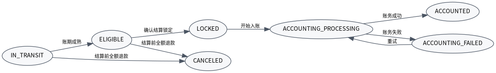

# 清结算平台 V004 SDD 开发准入总览

版本：V004  
日期：2026-06-14  
定位：正式技术方案规范对齐版，面向研发/Codex 开发准入。  
主关联对象：`SettlementBill`  
主关联编号：`bill_no`

## 1. 一句话结论

V004 在保留 V003 清结算平台业务方向的基础上，完成正式技术方案目录、DDD 领域模型、SDD 开发落地、DDL 统一规范、状态机矩阵、接口契约、幂等补偿、测试验收和 Codex 任务卡对齐。P0 仍然只做本地生活普通商品核销后清结算入账闭环；不引入冻结/止付，不把出款核心 TRANSFER 作为 P0 主链路。

## 2. 本版设计硬约束

| 类别 | V004 约束 |
|---|---|
| 平台定位 | 清结算平台按成熟本地生活/电商清结算中心设计，不被当前页面口径反向定义。 |
| P0 范围 | 只实现普通商品核销完成后的清分、清算、结算、账务入账、后台商家应付、商户端展示。 |
| 非 P0 | 不做自动出款、不接 TRANSFER、不做团餐/邀新/渠道全量接入、不做完整对账差错工作台。 |
| DDD | 明确限界上下文、聚合根、领域服务、不变量、领域事件。 |
| SDD | 明确 DDL、接口、DTO、状态机矩阵、事务边界、异常补偿、测试验收、开发任务卡。 |
| 数据库 | 金额字段统一 `BIGINT` 分；不设计 `currency / cur / currency_code`；不设计 `tenant_id`；主键统一 `BIGINT UNSIGNED`。 |
| 幂等 | 写入请求统一记录 `idempotent_key` 和 `request_hash`；同幂等键同 request_hash 返回原结果，不同 request_hash 拒绝。 |

## 3. 清结算主链路


P0 主链路：

```text
核销完成事件
  -> 清分生成订单级资金归属
  -> 清算生成待结算项并判断账期成熟
  -> 后台商家应付只展示 ELIGIBLE
  -> 平台运营统一确认结算，单条/批量共用方法
  -> 生成结算批次、结算单、结算明细
  -> 调用账户账务平台 recordProductSettlement 入账
  -> 商户账户可提现余额增加
```

## 4. DDD 限界上下文


| 限界上下文 | P0 | 说明 |
|---|---:|---|
| 事件接入上下文 | 是 | 接收核销完成、退款成功、取消核销事件，落 `ccs_source_event`。 |
| 清分上下文 | 是 | P0 从普通商品现有 finance_detail 映射标准清分结果。 |
| 清算上下文 | 是 | 管理在途、可结算、锁定、入账中、入账成功/失败等生命周期。 |
| 结算单上下文 | 是 | 生成批次、结算单、结算明细，执行统一确认结算。 |
| 账务入账编排上下文 | 是 | 调用账户账务平台，处理成功、失败、UNKNOWN。 |
| 商户资金查询上下文 | 是 | 为 BFF 提供标准读模型，适配产品宽口径待结算。 |
| 后台运营上下文 | 是 | 商家应付、结算记录、重试、人工核查。 |
| 对账差错上下文 | P1 | P0 只保留索引与状态基础，不建设完整工作台。 |
| 出款/TRANSFER 适配上下文 | P1/P2 | 不进入 P0 主链路。未来如需平台应收实收，再由独立适配器接入。 |

## 5. 状态机总览



P0 保留三套状态机：

| 状态机 | 状态 |
|---|---|
| 待结算项 | `IN_TRANSIT`、`ELIGIBLE`、`LOCKED`、`ACCOUNTING_PROCESSING`、`ACCOUNTING_FAILED`、`ACCOUNTED`、`CANCELED` |
| 结算单 | `CREATED`、`CONFIRMED`、`ACCOUNTING_PROCESSING`、`ACCOUNTED`、`ACCOUNTING_FAILED`、`UNKNOWN`、`CANCELED` |
| 账务入账单 | `INIT`、`REQUESTING`、`SUCCESS`、`FAILED`、`UNKNOWN` |

状态机必须由矩阵驱动开发和测试，不允许只实现 happy path。

## 6. 数据模型规范变化

V004 对 V003 DDL 做了规范统一：

| 项 | V003 | V004 |
|---|---|---|
| 金额字段 | `DECIMAL(18,2)` | `BIGINT`，单位分，人民币 |
| 币种字段 | 有 `currency` | 删除，P0 固定人民币 |
| 多租户字段 | 有 `tenant_id` | 删除，待统一多租户规范后单独决策 |
| 主键 | `BIGINT` | `BIGINT UNSIGNED` |
| 表字符集 | `utf8mb4` | `utf8mb4 COLLATE=utf8mb4_general_ci` |
| 幂等一致性 | 只有幂等键 | 补 `request_hash` |
| 跨平台业务归属 | 部分 source 字段 | 统一 `caller_system / biz_domain / biz_no` |

## 7. 主要开发文件入口

| 目标 | 文件 |
|---|---|
| 一期范围 | `01_业务场景与需求/00_一期普通商品范围与非范围.md` |
| DDD 设计 | `02_领域模型/00_领域模型总览.md` |
| 状态矩阵 | `03_流程与状态机/02_待结算项状态机.md`、`03_结算单状态机.md`、`04_账务入账单状态机.md` |
| 完整 DDL | `05_数据模型/02_DDL_V004_P0.sql` |
| 接口契约 | `04_接口契约/openapi.yaml` |
| 幂等补偿 | `06_一致性_幂等_异常_补偿/01_幂等规则.md`、`03_账务失败与UNKNOWN补偿.md` |
| Codex 任务卡 | `08_代码落地任务包/01_Codex开发任务卡.md` |
| 准出清单 | `08_代码落地任务包/05_准出清单.md` |

## 8. 开发准入结论

V004 可作为普通商品 P0 清结算开发准入依据。进入编码前仍需人工确认：旧链路切换时间点、账务接口返回字段、普通商品 finance_detail 字段最终映射、退款事件来源和 BFF 新老合并展示口径。
