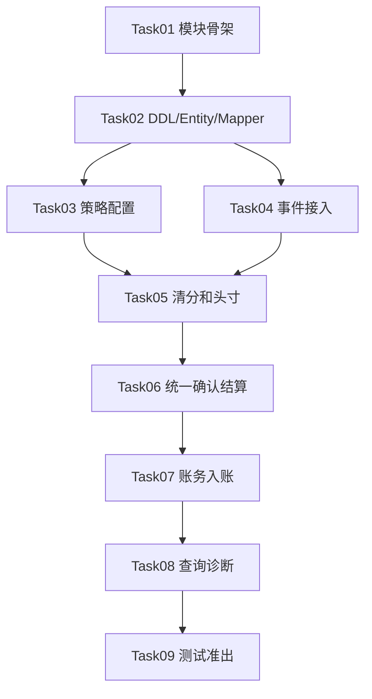

# 任务依赖图

```mermaid
flowchart TD
  T1[Task01 模块骨架] --> T2[Task02 DDL/Entity/Mapper]
  T2 --> T3[Task03 策略配置]
  T2 --> T4[Task04 事件接入]
  T3 --> T5[Task05 清分和头寸]
  T4 --> T5
  T5 --> T6[Task06 统一确认结算]
  T6 --> T7[Task07 账务入账]
  T7 --> T8[Task08 查询诊断]
  T8 --> T9[Task09 测试准出]
```
