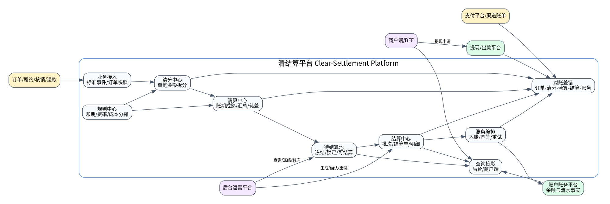
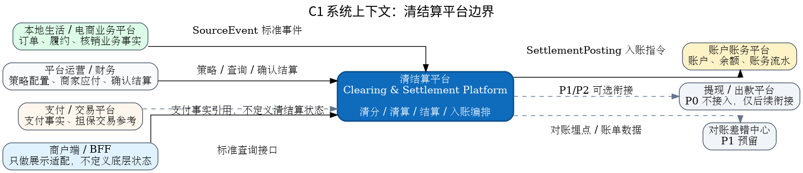
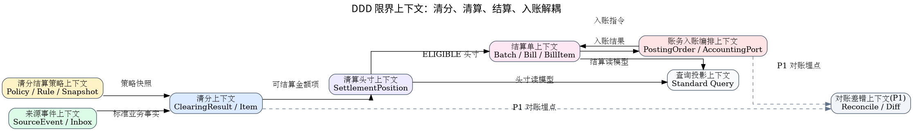
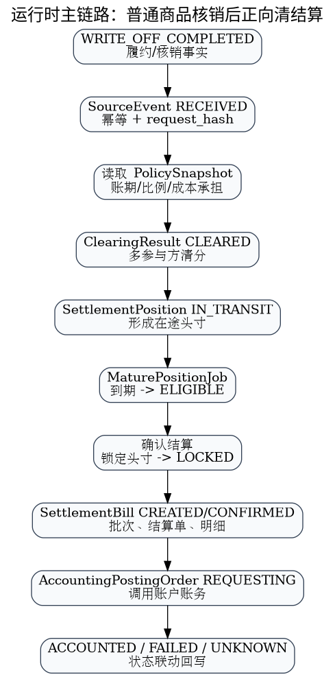

# 清结算平台 V009 正式开发方案总览

## 1. 总体结论

V009 是一套面向设计、开发、测试阶段的正式 SDD 技术方案。它基于成熟电商/本地生活清结算模型，以 DDD 表达领域边界，以 C4 和运行时视图表达架构，以 DDL/OpenAPI/状态机/任务卡支撑开发准入。

## 2. 核心图谱

### 能力地图

### 系统上下文

### DDD 限界上下文

### 正向主链路

### 数据血缘

## 3. P0 开发范围

P0 实现普通商品核销完成后的正向清结算闭环，不做冻结、退款、自动出款、BFF 展示适配和上线部署。

## 4. 开发入口

- DDD：`05_DDD领域设计/`
- 流程状态机：`07_核心流程与状态机/`
- DDL：`08_数据模型与存储设计/03_DDL_V009_P0.sql`
- 接口：`09_接口契约与事件协议/openapi.yaml`
- 测试：`13_测试验收/`
- 任务卡：`14_代码落地任务包/03_Codex开发任务卡.md`
