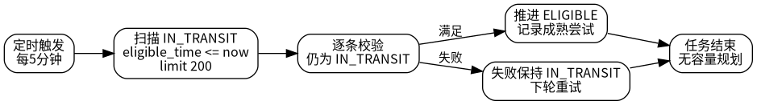
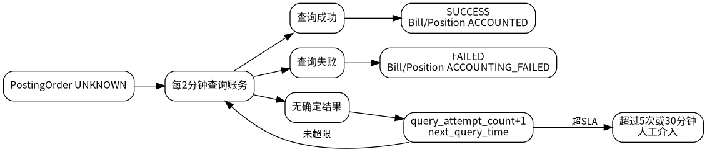

# 本地生活清结算平台 V010 SDD 正式开发方案总览

## 1. 版本定位

V010 是 P0 正确性闭环修订版。它保持 V009 的行业策略模型和成熟清结算平台主架构，不扩大 P0 范围，只补齐开发落地前必须明确的正确性细节。

P0 不做容量规划、不做性能优化、不做百万级导出、不做复杂分片调度。V010 只处理会影响资金正确性、状态机闭环和幂等一致性的关键问题。

## 2. 主模型

```text
SourceEvent
  -> ClearingResult
  -> ClearingResultItem
  -> SettlementPosition
  -> SettlementBatch
  -> SettlementBill
  -> SettlementBillItem
  -> AccountingPostingOrder
```

## 3. 本版关键修订

| 修订项 | 结论 |
|---|---|
| 账期成熟任务 | 新增 `SettlementPositionMaturityJob`，每 5 分钟、单轮 200 条，推进 `IN_TRANSIT -> ELIGIBLE`。 |
| 批量结算上限 | 单次 `confirmMerchantSettlement` 最多 500 个 `positionNo`，超限拒绝。 |
| UNKNOWN 补偿 | 每 2 分钟自动查询，最多 5 次；10 分钟 overdue；30 分钟人工介入。 |
| 操作日志 | afterCommit / REQUIRES_NEW / 异步写入，失败不回滚主事务。 |
| 导出能力 | `/eligible/export` 非 P0，清结算平台只提供分页查询。 |
| request_hash | SHA-256 + Canonical JSON + 字段集合标准化。 |

## 4. 账期成熟任务



账期成熟任务不是容量设计，而是状态机闭环。没有该任务，头寸会停留在 `IN_TRANSIT`，后台无法稳定查询 `ELIGIBLE` 可结算数据。

## 5. UNKNOWN 补偿 SLA



`UNKNOWN` 状态禁止直接重复入账。系统必须先按账务请求号或账务幂等键查询账务平台，再回正为 `SUCCESS` 或 `FAILED`。

## 6. 操作日志事务策略


操作日志是审计辅助数据，不是资金事实唯一来源。主事务提交后写日志，日志失败不回滚资金主事务。

## 7. 开发准入边界

### 7.1 允许实现

```text
来源事件接入
清分结果生成
结算头寸生成和成熟
后台可结算头寸分页查询
统一确认结算
账务入账编排
UNKNOWN 补偿
基础审计日志
P0 测试矩阵
```

### 7.2 禁止实现

```text
退款
冻结/止付
出款/提现
BFF 展示口径适配
/eligible/export
容量规划
分库分表
百万级导出
复杂任务调度
```

## 8. 关键开发文件

| 文件 | 作用 |
|---|---|
| `07_核心流程与状态机/03_清算与头寸成熟流程.md` | 账期成熟任务规格。 |
| `10_一致性_幂等_异常_补偿/02_幂等与request_hash.md` | request_hash 标准。 |
| `10_一致性_幂等_异常_补偿/04_账务UNKNOWN补偿.md` | UNKNOWN SLA 和补偿流程。 |
| `08_数据模型与存储设计/03_DDL_V010_P0.sql` | V010 P0 DDL。 |
| `09_接口契约与事件协议/openapi.yaml` | P0 API 契约。 |
| `14_代码落地任务包/03_Codex开发任务卡.md` | 开发任务卡。 |

## 9. 开发结论

V010 可以进入 P0 开发。开发时应按任务卡逐步实现，不允许擅自扩大到退款、冻结、出款、导出和容量规划。
