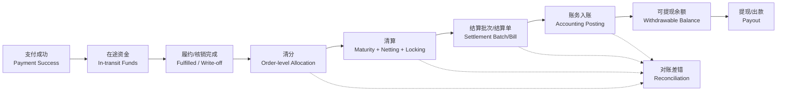
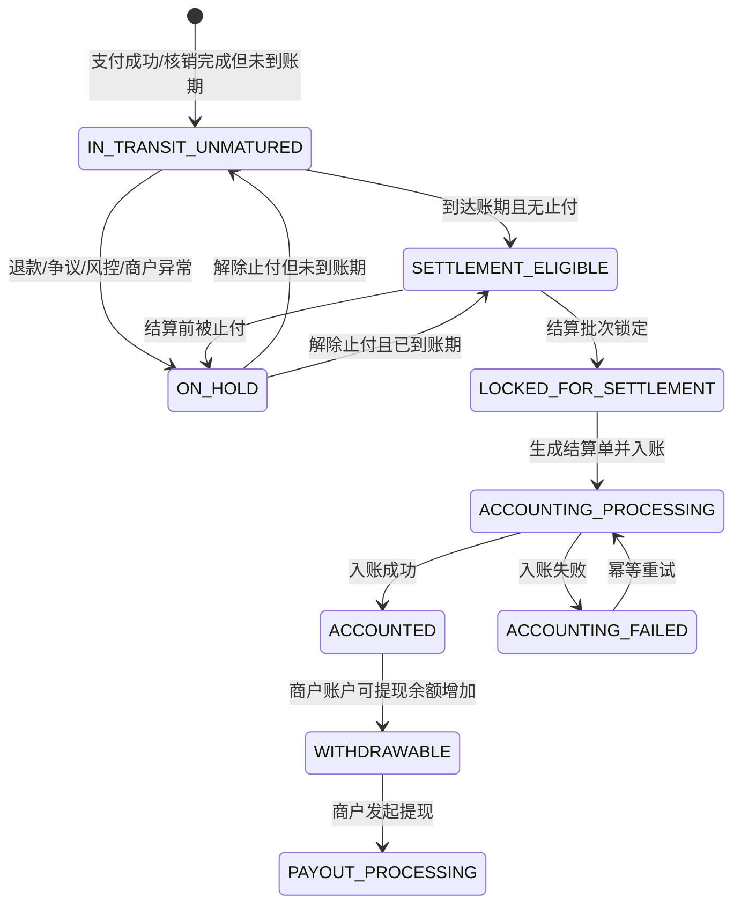
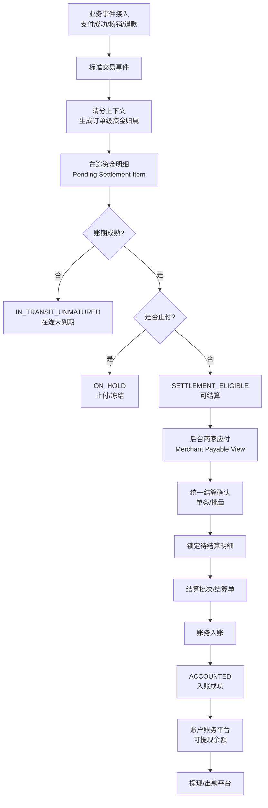
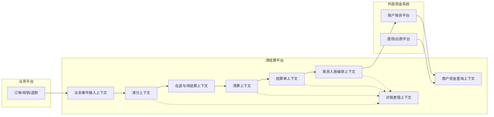

# 清结算平台 SDD V002 行业标准修订版


---

<!-- 来源：01_系统设计要求/01_系统设计硬约束.md -->

# 系统设计硬约束

## 1. 设计定位

清结算平台不是当前“商家应付页面”的后端实现，也不是 `local_settlement_record` 的字段增强。
它是面向本地生活/电商类交易平台的资金域中台，负责承接交易、履约、核销、退款、优惠、分佣等业务事件，形成可追溯、可对账、可入账、可扩展的清结算能力。

## 2. 行业标准优先

平台设计必须优先采用成熟行业语言和资金模型，不能被当前产品文案绑定。

| 当前产品/页面可能使用的词 | 平台底层标准语言 | 说明 |
|---|---|---|
| 待结算 | 在途资金 / 待结算展示口径 / 可结算项 | 产品“待结算”可聚合多种状态，底层必须拆清楚。 |
| 商家应付 | 商户应付头寸 / Merchant Payable Position | 后台页面是清算结果和结算候选项的运营视图。 |
| 结算记录 | 结算单 / Settlement Bill | 必须有状态机、明细、幂等、入账关系。 |
| 平台分账规则 | 清分规则 / Clearing Rule | 应输出订单级清分结果和规则快照。 |
| 已结算 | 账务入账成功 / Accounted Settlement | 只有入账成功才能算底层已结算。 |
| 冻结金额 | 资金止付/冻结 Hold / 提现中占用 | 不等同于在途，也不等同于待结算。 |

## 3. 一期需求只是平台接入方

当前原型中普通商品、团餐、邀新、渠道权益券等需求，只作为平台能力的接入样例。
底层模型要先按成熟清结算平台设计，再决定一期裁剪实现。

## 4. BFF 可以适配业务口径

当当前产品口径与行业标准不一致时，不污染底层领域模型，由 BFF / Query Facade 做聚合和翻译。

示例：当前产品的“待结算”如果定义为“核销完成但未结算”，底层可以这样映射：

```text
产品待结算 = IN_TRANSIT_UNMATURED + SETTLEMENT_ELIGIBLE + SETTLEMENT_LOCKED/PROCESSING（按展示需要决定）
```

底层仍保留严格状态：

```text
IN_TRANSIT_UNMATURED   在途未到期
SETTLEMENT_ELIGIBLE   已到期可结算
ON_HOLD               止付/冻结
LOCKED_FOR_SETTLEMENT 已锁定进结算批次
ACCOUNTING_PROCESSING 入账处理中
ACCOUNTED             入账成功，可提现余额增加
```

## 5. 不以历史债务约束平台模型

当前系统没有独立清结算平台，结算能力分散在后台结算 CRUD、账户账务、渠道结算、商户 App BFF 等模块中。V002 设计不以旧表为核心，只在实施章节给出迁移和兼容策略。

## 6. 资金安全设计原则

1. 任何资金状态变化必须有来源事件、业务单号、幂等键、操作记录。
2. 清分结果必须可追溯到原始交易和规则快照。
3. 清算锁定必须防止重复结算。
4. 结算单必须有状态机，不能“创建即成功”。
5. 账务入账必须幂等，并能反查结算单。
6. 已结算展示以账务入账成功为准。
7. 对账差错是平台能力，不依赖人工查库。
8. 资金冻结/止付作为成熟平台的标准能力预留，一期可以只建模，不强制实现业务规则。


---

<!-- 来源：01_系统设计要求/02_领域语言修订表.md -->

# 领域语言修订表

## 1. 核心术语

| 术语 | 英文 | 定义 | 一期是否实现 |
|---|---|---|---|
| 交易事件 | Trade Event | 支付成功、核销完成、退款成功、取消核销等业务事实。 | 是 |
| 履约/核销 | Fulfillment / Write-off | 用户权益被消费或服务完成，是本地生活结算成熟的重要触发点。 | 是 |
| 在途资金 | In-transit Funds | 支付成功后、最终结算入账前处于平台交易链路中的资金事实。 | 是，至少作为状态模型 |
| 清分 | Clearing Allocation | 单笔订单维度计算资金归属，拆分商户、平台、渠道、服务商、推广方等份额。 | 是 |
| 清分结果 | Clearing Result | 清分后的订单级资金归属快照。 | 是 |
| 清算 | Settlement Preparation / Netting | 结算前的账期成熟判断、汇总、轧差、锁定、金额校验和结算候选生成。 | 是 |
| 待结算项 | Pending Settlement Item | 清分结果中尚未完成结算入账的商户应得明细。可细分未到期、已到期、止付、锁定。 | 是 |
| 可结算项 | Settlement Eligible Item | 达到账期、未止付、未锁定、未结算的待结算项。 | 是 |
| 商户应付头寸 | Merchant Payable Position | 按商户、业务线、周期聚合后的可结算金额。 | 是 |
| 结算批次 | Settlement Batch | 一次运营确认或系统自动结算形成的批次。 | 是 |
| 结算单 | Settlement Bill | 面向商户/结算主体的结算凭证和状态载体。 | 是 |
| 账务入账 | Accounting Posting | 将结算结果调用账户账务平台，生成余额和流水事实。 | 是 |
| 可提现余额 | Withdrawable Balance | 账务入账成功后，商户可发起提现的账户余额。 | 由账户账务平台提供 |
| 提现/出款 | Withdraw / Payout | 商户把账户余额出款到银行卡/支付账户。 | 非一期核心 |
| 止付/冻结 | Hold / Freeze | 因风控、争议、退款、商户异常、合规要求，临时禁止结算或提现。 | 建模预留，P1/P2 规则实现 |
| 对账 | Reconciliation | 比对订单、清分、清算、结算、账务、出款数据，发现漏结、重结、错结。 | P1，模型预留 |
| 差错 | Exception / Discrepancy | 对账发现的异常，如金额不一致、状态不一致、重复入账。 | P1 |

## 2. 禁止混用

| 禁止混用 | 说明 |
|---|---|
| 在途资金 ≠ 冻结资金 | 在途是交易生命周期状态；冻结/止付是限制动作或风险状态。 |
| 待结算展示 ≠ 可结算项 | 产品可把核销后未结算都展示为待结算；底层必须区分是否到期。 |
| 结算记录 ≠ 账务流水 | 结算单是业务凭证，账务流水是资金账户事实。 |
| 结算成功 ≠ 出款成功 | 结算成功只表示商户账户入账成功；提现/出款是后续资金出账流程。 |
| 清分 ≠ 清算 ≠ 结算 | 清分算单笔订单归属；清算做周期聚合和锁定；结算生成单据并入账。 |


---

<!-- 来源：02_行业标准模型/01_行业清结算参考模型.md -->

# 行业清结算参考模型

## 1. 本方案只参考电商/本地生活平台

本方案不泛化到证券、银行间清算或跨境金融市场。对“清算/结算”的基础定义参考支付清算行业通用术语，但平台能力模型只落到电商与本地生活交易场景。

## 2. 成熟平台的通用资金主线



## 3. 冻结/止付能力在成熟平台中是否存在

成熟的电商/本地生活交易资金平台通常会有冻结、止付或保留能力，但它不应该替代“在途”概念。

| 能力 | 行业含义 | 本平台口径 |
|---|---|---|
| 在途资金 | 支付成功后、结算入账前的交易资金状态 | 一期主线必须有。 |
| 冻结户/担保户 | 第三方平台或支付通道用于担保交易的账户表达 | 本平台不直接管理真实资金户，只记录状态和结算资格。 |
| 止付/Hold | 因退款、争议、风控、商户异常等限制结算或提现 | 平台底层必须建模，P0 可不实现复杂规则。 |
| 可提现账户 | 结算或分账后资金进入可提现余额 | 由账户账务平台提供余额事实。 |

## 4. 标准资金状态



## 5. 对当前产品口径的处理

当前产品把“核销完、未结算”称为待结算，这是可以接受的展示口径。但底层平台必须保留行业标准状态。

```text
商户端待结算展示 = IN_TRANSIT_UNMATURED + SETTLEMENT_ELIGIBLE + LOCKED_FOR_SETTLEMENT/ACCOUNTING_PROCESSING（可配置）
后台商家应付 = SETTLEMENT_ELIGIBLE
后台结算中 = LOCKED_FOR_SETTLEMENT + ACCOUNTING_PROCESSING
商户端已结算 = ACCOUNTED
可提现余额 = Accounting Platform available balance
```

## 6. 行业依据

- 支付清算行业中，clearing 通常包含结算前的传输、核对、确认、轧差/净额计算，settlement 才是最终解除资金义务或完成资金交割。
- 本地生活/电商平台公开方案中，支付后进入在途/冻结/担保资金，满足履约或分账周期后再结算到可提现账户，是常见模式。
- 大规模平台对账一般按漏结、重复结、错结治理，并优先采用双向、明细级对账。


---

<!-- 来源：03_SDD修订版/00_SDD修订总览.md -->

# SDD 修订总览

## 1. 本次修订目标

V002 的目标是把清结算平台从“当前产品页面驱动”修订为“行业标准领域模型驱动”。

修订后的设计满足：

1. 术语符合电商/本地生活清结算平台成熟口径。
2. 平台底层支持大规模多业务线，不被当前页面文案绑定。
3. 当前需求通过 Adapter + Query BFF 纳入一期，而不是污染核心领域。
4. 一期可开发范围清晰，后续扩展不需要推翻底层模型。

## 2. 关键修订点

| 编号 | V001 问题 | V002 修订 |
|---|---|---|
| REV-001 | 资金主线出现“支付冻结”，容易被误解为当前需求已有冻结 | 改为“支付成功形成在途资金/担保资金事实”；冻结/止付作为风险限制能力独立建模。 |
| REV-002 | 待结算口径容易被当前产品绑定 | 底层拆为 `IN_TRANSIT_UNMATURED`、`SETTLEMENT_ELIGIBLE`、`LOCKED_FOR_SETTLEMENT` 等，BFF 聚合展示。 |
| REV-003 | 清算解释不够行业化 | 明确定义为清分后、结算前的账期成熟、聚合轧差、锁定、金额校验、结算候选生成。 |
| REV-004 | 当前需求对平台设计影响过大 | 建立“行业核心模型 + 当前业务适配层”的设计硬约束。 |
| REV-005 | 冻结是否需要设计不明确 | 作为成熟清结算平台标准能力预留：P0 建状态和字段，P1/P2 实现风控/争议/退款止付规则。 |
| REV-006 | 单条/批量结算可能被拆两套逻辑 | 统一为 `confirmMerchantSettlement(command)`，单条是批量大小为 1 的特殊情况。 |
| REV-007 | 当前产品“商家应付”与平台清算层关系不清 | 定义后台商家应付 = `SETTLEMENT_ELIGIBLE` 的运营视图。 |

## 3. 修订后的主链路



## 4. 一期实现裁剪

| 能力 | 平台是否设计 | 一期是否实现 | 说明 |
|---|---:|---:|---|
| 在途资金状态 | 是 | 是 | 支付/核销后未入账均属于在途生命周期。 |
| 清分结果 | 是 | 是 | 可以先映射现有 finance_detail，后续独立计算。 |
| 清算成熟判断 | 是 | 是 | 结算周期 + 核销时间。 |
| 止付/冻结 | 是 | 字段/状态预留 | 不做复杂风控规则。 |
| 商家应付 | 是 | 是 | 只展示可结算项。 |
| 单条/批量结算 | 是 | 是 | 一个核心方法。 |
| 结算单状态机 | 是 | 是 | 必须实现。 |
| 账务入账 | 是 | 是 | 复用账户账务平台。 |
| 商户端待结算展示 | 是 | 是 | BFF 聚合在途/可结算。 |
| 对账差错 | 是 | P1 | 一期保留表和接口边界可选。 |
| 自动出款 | 是 | 否 | 结算只入账，可提现后由提现平台处理。 |


---

<!-- 来源：04_DDD领域设计/01_限界上下文与领域语言.md -->

# 限界上下文与领域语言

## 1. 限界上下文总览



## 2. 上下文职责

| 上下文 | 核心职责 | 关键对象 |
|---|---|---|
| 业务事件接入 | 接收业务事件，转为标准交易事件，保证幂等。 | `TradeEvent`、`SourceEvent` |
| 清分 | 单笔订单资金归属计算，保存规则快照。 | `ClearingResult`、`ClearingResultItem`、`RuleSnapshot` |
| 在途与待结算 | 管理清分后未入账的资金生命周期。 | `PendingSettlementItem`、`InTransitStatus`、`HoldRecord` |
| 清算 | 账期成熟、止付判断、聚合轧差、锁定、生成结算候选。 | `SettlementPosition`、`ClearingBatch` |
| 结算单 | 生成结算批次、结算单、结算明细和状态机。 | `SettlementBatch`、`SettlementBill`、`SettlementBillItem` |
| 账务入账编排 | 调用账户账务平台，处理幂等、失败、未知、重试。 | `AccountingPostingOrder` |
| 商户资金查询 | 提供 BFF 展示口径，翻译产品用词。 | `MerchantFinanceProjection` |
| 对账差错 | 发现漏结、重结、错结，记录并处理差异。 | `ReconcileTask`、`ReconcileDiff` |

## 3. 聚合边界

### PendingSettlementItem 聚合

不变量：

1. 同一个清分明细只能对应一个有效待结算项。
2. `ACCOUNTED` 后不可再次被锁定。
3. `ON_HOLD` 状态不可进入结算批次。
4. 锁定必须带 `settlement_batch_no` 和幂等键。
5. 解除止付后必须重新判断账期成熟。

### SettlementBill 聚合

不变量：

1. 结算单金额等于明细金额之和。
2. 同一结算单只允许一次成功入账。
3. 重试必须复用同一个 `accounting_idempotent_key`。
4. 只有 `ACCOUNTED` 才可对外展示为底层已结算。
5. 结算单取消只允许在未入账前执行。

## 4. 领域事件

| 事件 | 触发时机 | 消费方 |
|---|---|---|
| `TradeEventAccepted` | 标准业务事件入库成功 | 清分上下文 |
| `ClearingResultGenerated` | 清分结果生成 | 在途与待结算上下文 |
| `PendingItemMatured` | 账期成熟 | 清算上下文/后台查询投影 |
| `PendingItemHeld` | 被止付 | 商户查询投影、运营后台 |
| `SettlementPositionLocked` | 清算锁定可结算项 | 结算单上下文 |
| `SettlementBillCreated` | 结算单生成 | 账务入账编排 |
| `SettlementAccounted` | 账务入账成功 | 商户查询投影、对账上下文 |
| `SettlementAccountingFailed` | 入账失败 | 运营后台、重试任务 |
```


---

<!-- 来源：05_开发落地/01_一期实现边界与BFF适配.md -->

# 一期实现边界与 BFF 适配

## 1. 一期目标

一期只实现本地生活普通商品从核销完成到商户账户入账的清结算闭环：

```text
核销完成
  -> 标准事件
  -> 清分结果/规则快照
  -> 在途待结算项
  -> 账期成熟后进入可结算
  -> 后台商家应付
  -> 运营单条/批量确认结算
  -> 结算批次/结算单/明细
  -> 账户账务入账
  -> 商户端展示已结算与账户流水
```

## 2. 一期不做但必须设计预留

| 能力 | 一期处理 |
|---|---|
| 风控止付/冻结规则 | 只预留 `hold_status`、`hold_reason`、`hold_no`，不做复杂规则引擎。 |
| 自动结算 | 手动结算为主，自动任务接口预留。 |
| 自动出款 | 不做，入账后由商户提现平台处理。 |
| 团餐/邀新/渠道权益券 | DDD 模型支持，具体接入 P1/P2。 |
| 对账差错工作台 | P1；一期至少保留结算单与账务流水可反查。 |
| 历史数据全量迁移 | 不做；新老双轨，旧链路查询兼容。 |

## 3. 当前产品“待结算”的 BFF 适配

底层标准状态：

```text
IN_TRANSIT_UNMATURED    在途未到期
SETTLEMENT_ELIGIBLE    到期可结算
ON_HOLD                止付/冻结
LOCKED_FOR_SETTLEMENT  已锁定进结算批次
ACCOUNTING_PROCESSING  入账处理中
ACCOUNTED              入账成功
```

当前产品若要求“核销完、未结算都叫待结算”，BFF 查询可以这样处理：

| 产品展示项 | 底层查询范围 | 说明 |
|---|---|---|
| 商户端待结算金额 | `IN_TRANSIT_UNMATURED + SETTLEMENT_ELIGIBLE` | 默认不含 `ON_HOLD`，如产品要展示冻结金额则单列。 |
| 后台商家应付 | `SETTLEMENT_ELIGIBLE` | 后台只给可结算项操作，不能混入未到期。 |
| 结算中 | `LOCKED_FOR_SETTLEMENT + ACCOUNTING_PROCESSING` | 可在商户端合并到待结算或单列，取决于页面。 |
| 已结算 | `ACCOUNTED` | 以账务入账成功为准。 |
| 冻结/止付金额 | `ON_HOLD` | 一期可不展示，P1 再做。 |

## 4. 统一结算确认方法

单条和批量结算共用一个应用服务方法：

```java
SettlementBillNo confirmMerchantSettlement(ConfirmMerchantSettlementCommand command);
```

命令对象：

```java
class ConfirmMerchantSettlementCommand {
    String merchantId;
    String businessScene;
    List<String> pendingItemIds;
    String voucherUrl;
    String operatorId;
    String operatorName;
    String remark;
    String requestId;
}
```

单条结算：`pendingItemIds.size() == 1`。  
批量结算：`pendingItemIds.size() > 1`。

批量校验：

1. 全部属于同一商户。
2. 全部属于同一结算主体。
3. 全部已到账期且未止付。
4. 全部未锁定、未结算。
5. 全部币种一致。
6. 金额汇总等于明细金额之和。
7. 一期采用全成功/全失败，不做部分成功。

## 5. 推荐开发改动

| 层 | 建议 |
|---|---|
| Controller | 可保留 `settle-one` / `settle-batch` 两个入口，但都转换成统一 Command。 |
| Application Service | 只保留一套 `confirmMerchantSettlement` 流程。 |
| Domain Service | 做结算资格校验、锁定、金额校验。 |
| SettlementBill Aggregate | 生成结算单、明细、状态机。 |
| Accounting Adapter | 复用现有账户账务平台，幂等入账。 |
| Merchant Query BFF | 按产品口径聚合标准状态。 |


---

<!-- 来源：05_开发落地/02_开发级修订说明.md -->

# 开发级修订说明

## 1. 表模型修订建议

### ccs_pending_settlement_item

必须表达在途、到期、止付、锁定、入账状态。

| 字段 | 说明 |
|---|---|
| `pending_item_no` | 待结算项编号，全局唯一。 |
| `source_event_no` | 来源事件编号。 |
| `clearing_result_no` | 清分结果编号。 |
| `business_scene` | 业务场景，如 LOCAL_LIFE_NORMAL。 |
| `merchant_id` | 商户。 |
| `settlement_subject_id` | 结算主体。 |
| `amount` | 待结算金额。 |
| `currency` | 币种，默认 CNY。 |
| `fulfillment_time` | 履约/核销时间。 |
| `settlement_due_time` | 账期成熟时间。 |
| `lifecycle_status` | `IN_TRANSIT_UNMATURED` / `SETTLEMENT_ELIGIBLE` / `ON_HOLD` / `LOCKED_FOR_SETTLEMENT` / `ACCOUNTED`。 |
| `hold_status` | `NONE` / `HELD`。 |
| `hold_reason` | 止付原因。 |
| `settlement_batch_no` | 锁定批次。 |
| `settlement_bill_no` | 结算单号。 |
| `version` | 乐观锁。 |

### ccs_settlement_bill

必须表达结算单状态机。

| 字段 | 说明 |
|---|---|
| `settlement_bill_no` | 结算单号。 |
| `settlement_batch_no` | 批次号。 |
| `merchant_id` | 商户。 |
| `business_scene` | 业务线。 |
| `bill_amount` | 结算金额。 |
| `bill_status` | `CREATED` / `ACCOUNTING_PROCESSING` / `ACCOUNTED` / `ACCOUNTING_FAILED` / `CANCELED` / `UNKNOWN`。 |
| `accounting_request_no` | 账务请求号。 |
| `accounting_idempotent_key` | 入账幂等键。 |
| `voucher_url` | 凭证。 |
| `operator_id` | 操作人。 |
| `confirmed_time` | 确认时间。 |
| `accounted_time` | 入账成功时间。 |
| `fail_reason` | 失败原因。 |
| `retry_count` | 重试次数。 |

## 2. 关键唯一约束

| 表 | 唯一约束 | 目的 |
|---|---|---|
| `ccs_source_event` | `(source_system, source_event_type, source_biz_no)` | 防止事件重复接入。 |
| `ccs_clearing_result` | `(business_scene, source_order_no, clearing_version)` | 防止重复清分。 |
| `ccs_pending_settlement_item` | `(clearing_result_item_no)` | 一条清分明细只生成一条有效待结算项。 |
| `ccs_settlement_bill` | `(settlement_bill_no)` | 结算单唯一。 |
| `ccs_settlement_bill_item` | `(pending_item_no)` where active | 防止同一待结算项进入多个有效结算单。 |
| `ccs_accounting_order` | `(accounting_idempotent_key)` | 防止重复入账。 |

## 3. 核心应用服务伪代码

```java
@Transactional
public SettlementBillNo confirmMerchantSettlement(ConfirmMerchantSettlementCommand command) {
    // 1. 幂等检查
    IdempotentGuard.acquire(command.requestId());

    // 2. 查询并锁定待结算项
    List<PendingSettlementItem> items = pendingRepo.lockByIds(command.pendingItemIds());

    // 3. 结算资格校验
    settlementEligibilityService.assertEligible(items, command.merchantId());

    // 4. 生成批次和结算单
    SettlementBatch batch = SettlementBatch.create(command.operatorId());
    SettlementBill bill = SettlementBill.create(batch.no(), command.merchantId(), items, command.voucherUrl());

    // 5. 锁定待结算项
    items.forEach(item -> item.lockForSettlement(batch.no(), bill.no()));

    // 6. 持久化
    batchRepo.save(batch);
    billRepo.save(bill);
    pendingRepo.saveAll(items);

    // 7. 同步或异步触发账务入账
    accountingAppService.postSettlementBill(bill.no());

    return bill.no();
}
```

## 4. 账务入账伪代码

```java
public void postSettlementBill(String billNo) {
    SettlementBill bill = billRepo.findByNo(billNo);
    if (bill.isAccounted()) return;

    bill.markAccountingProcessing();
    billRepo.save(bill);

    try {
        AccountingResult result = accountingFacade.recordGenericSettlement(
            bill.toAccountingCommand()
        );
        bill.markAccounted(result.requestNo(), result.flowNo());
        pendingRepo.markAccountedByBillNo(billNo);
    } catch (TimeoutException e) {
        bill.markUnknown(e.getMessage());
    } catch (Exception e) {
        bill.markAccountingFailed(e.getMessage());
    }
    billRepo.save(bill);
}
```

## 5. BFF 查询伪代码

```java
public MerchantPendingAmountVO queryMerchantPendingAmount(String merchantId) {
    Money inTransit = pendingQuery.sum(merchantId, IN_TRANSIT_UNMATURED);
    Money eligible = pendingQuery.sum(merchantId, SETTLEMENT_ELIGIBLE);
    Money processing = pendingQuery.sum(merchantId, LOCKED_FOR_SETTLEMENT, ACCOUNTING_PROCESSING);

    return new MerchantPendingAmountVO(
        productPendingAmount = inTransit.add(eligible).add(processing),
        inTransitAmount = inTransit,
        eligibleAmount = eligible,
        processingAmount = processing
    );
}
```


---

<!-- 来源：07_评审清单/01_方案修订点清单.md -->

# 方案修订点清单

## 1. 必须改

| 编号 | 修订项 | 结论 |
|---|---|---|
| M-001 | 资金主线术语 | 删除“支付冻结”作为主线，改成“支付成功形成在途资金/担保资金事实”。 |
| M-002 | 冻结能力 | 冻结/止付是成熟平台标准能力，作为状态维度预留，不作为一期业务规则强依赖。 |
| M-003 | 待结算口径 | 产品“待结算”不等于底层可结算，必须由 BFF 聚合。 |
| M-004 | 商家应付 | 后台商家应付只展示 `SETTLEMENT_ELIGIBLE`。 |
| M-005 | 单条/批量结算 | 共用一个应用服务方法，批量只是明细数量大于 1。 |
| M-006 | 清算定义 | 清算是结算前的成熟判断、聚合、轧差、锁定、金额校验和候选生成。 |
| M-007 | 领域模型 | 底层按行业标准 DDD，不按当前原型页面建模。 |
| M-008 | 对账差错 | 作为成熟平台必须能力进入架构设计，P1 实现。 |

## 2. 评审问题

| 问题 | 建议结论 |
|---|---|
| 一期是否实现止付/冻结操作入口？ | 不实现，只建模预留。 |
| 商户端“待结算”是否包含未到账期？ | 包含，这是产品展示口径；底层拆状态。 |
| 后台“商家应付”是否包含未到账期？ | 不包含，只可操作已到期可结算项。 |
| 结算失败是否展示给商户？ | 商户端不展示失败原因，后台展示。 |
| 账务未知状态如何处理？ | 标记 `UNKNOWN`，后台人工核查或幂等查询修复。 |
| 是否现在接自动出款？ | 不接。结算入账到可提现余额，提现由出款平台负责。 |

## 3. 开发验收口径

1. 清分结果、待结算项、结算单、账务入账单必须可互相追溯。
2. 单条和批量结算必须走同一核心方法。
3. 同一待结算项不能进入两个成功结算单。
4. 未到账期待结算项不能出现在后台商家应付操作列表。
5. 商户端待结算金额可以聚合未到期和已到期，但必须能解释数据来源。
6. 结算单只有 `ACCOUNTED` 才算底层已结算。
7. 账务幂等键重复调用不能重复增加商户余额。
8. 所有结算确认必须记录操作人、凭证和时间。


---

<!-- 来源：07_评审清单/02_参考依据.md -->

# 参考依据

## 行业定义与最佳实践

1. BIS CPMI Glossary：支付、清算、结算、轧差等基础术语。  
   https://www.bis.org/cpmi/glossary.pdf

2. 美团旅行结算平台实践：结算平台化、多业务线接入、账单/付款/发票能力平台化。  
   https://tech.meituan.com/2018/01/15/high-performance-platform-design.html

3. 美团配送资金安全治理之对账体系建设：漏结、重复结、错结、双向对账、明细对账、差错处理。  
   https://tech.meituan.com/2018/03/21/balance-accounts.html

4. 抖音小程序支付账户说明：在途总资金、可提现资金。  
   https://developer.open-douyin.com/docs/resource/zh-CN/mini-app/open-capacity/business-monetization/guaranteed-payment/FAQ/paymentt

5. 快手小程序结算能力：交易满足规则后，从冻结户/在途资金转移到可提现账户，支持自动结算和主动结算。  
   https://open.kuaishou.com/docs/develop/server/epay/open-api-new/settle-new.html

6. 支付宝直付通产品介绍：平台可根据规则发起请款，金额不超过待结算总余额，支持平台抽佣。  
   https://opendocs.alipay.com/open/01q8zy

## 项目输入

1. `00_原始输入/本地生活_美食封板_V001_20260613_原始交付包.zip`
2. `00_原始输入/结算相关需求提取清单_V001.md`
3. `00_原始输入/当前系统清结算现状调研报告.txt`
